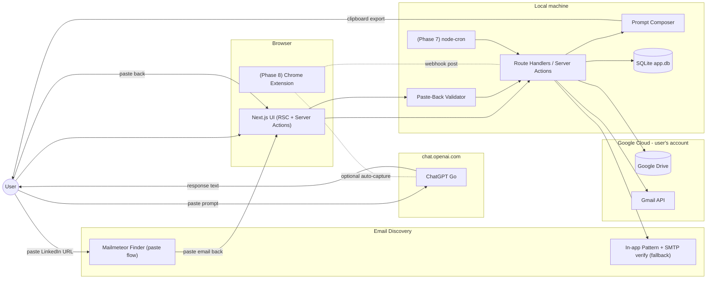
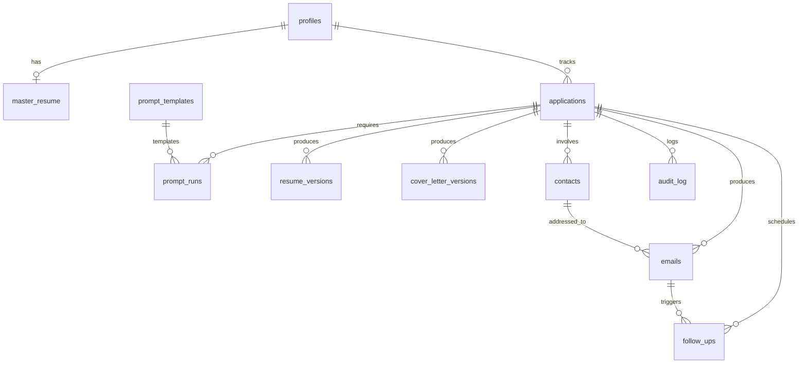
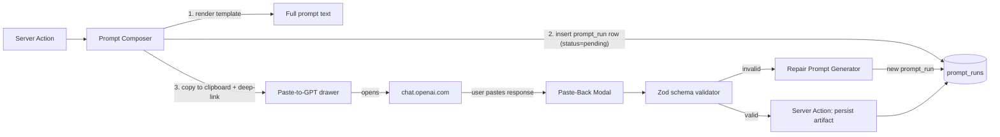
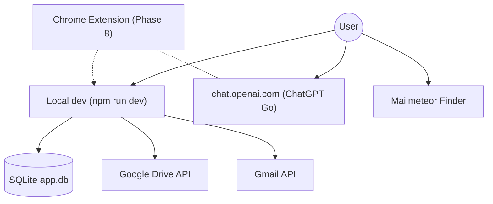
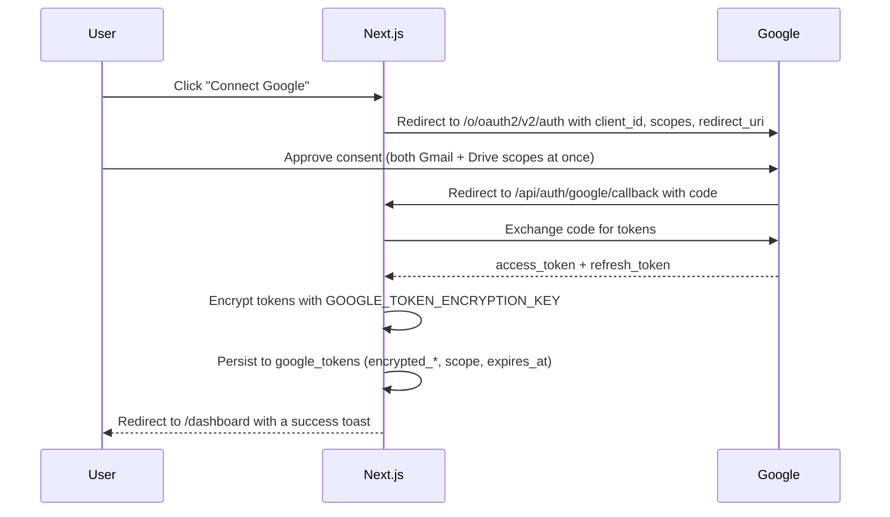

# AI-Powered Job Application & Outreach Automation Platform — Architecture

> Companion to [`problemstatement.md`](problemstatement.md). This document describes a **phase-wise** architecture that delivers the platform end-to-end with **your existing ChatGPT Go subscription as the only paid dependency** and every other service on a permanent free tier. It is opinionated where a choice must be made and calls out risks where free tiers may bite.

---

## 0. Executive Summary

**What we're building.** A single-user, **local-first** web app (runs on your machine) that turns "paste a JD + a few LinkedIn URLs" into a complete, tracked application package: tailored resume + cover letter + role-specific cold emails + follow-ups + tracker + dashboard.

**Design pillars.**

1. **~$0 recurring cost beyond ChatGPT Go** — every third-party dependency has a permanent free tier. No trial-only services.
2. **The user *is* the LLM API** — every model call is a **prompt exported to clipboard → user pastes into ChatGPT Go → response pasted back**. Zero LLM rate limits from our side; no API keys; unlimited daily volume within ChatGPT's own generous message allowance.
3. **Structured contracts, not vibes** — every paste-back is validated against a JSON schema before it's accepted. If the response is malformed, the app tells the user exactly what's wrong and offers a "repair" prompt to run.
4. **User approval before any outbound side-effect** — matches Out-of-Scope §11. Emails are always drafted, never auto-sent, in v1.
5. **Deterministic, versioned artifacts** — every generated resume, cover letter, email is immutable and traceable to the exact prompt that produced it.
6. **Phased delivery** — each phase is independently useful and has a hard exit criterion so we never ship half-finished layers.

**Non-goals for v1.** Auto-submit to LinkedIn, unattended email send, interview scheduling, salary/offer tooling (all per problem statement §11).

---

## 1. Locked Constraints

| Constraint | Decision |
|---|---|
| LLM strategy | **ChatGPT Go via paste-to-GPT flow.** The app never calls an LLM API. It composes prompts, copies them to the clipboard, opens ChatGPT.com in a new tab, and accepts the response through a validated paste-back modal. Optional Phase 8 Chrome extension captures the response automatically. |
| LLM budget | Your existing ChatGPT Go subscription. Zero incremental API spend. |
| Hosting | **Local-first** — `npm run dev` on your machine. Next.js App Router + Server Actions. Not designed for serverless deploy (SQLite file must persist on disk). |
| DB | **SQLite** (`better-sqlite3`) — local file at `web/data/app.db`. Auto-migrated on first run. |
| App auth | **None** — single-user, trusted local environment. No magic link, no login screen. |
| File storage | **Google Drive** (15 GB free personal quota) via Drive API. Generated PDFs/DOCX land in a user-owned folder tree the user can browse, share, and back up. Master resume source files go here too. |
| Concurrency control | **SQLite atomic UPDATEs** — `UPDATE … WHERE status = 'pending'` with `changes` check, plus unique constraints. Solo, one-at-a-time usage. See §5.1. |
| Email send | **Gmail API** via Google OAuth (scope `gmail.compose`) — **draft-only in v1**. Same Google OAuth consent covers Drive + Gmail so the user connects Google once. |
| Email discovery | **Mailmeteor LinkedIn Email Finder** (free, unlimited manual lookups) via a paste-back flow. In-app pattern-generator + SMTP-verify remains as a last-resort local fallback when Mailmeteor returns nothing. |
| Cron | Local `node-cron` script or manual triggers (Phase 7). No Vercel Cron / pg_cron. |
| LinkedIn scraping | **Not in v1.** User pastes profile text. A Phase 8 Chrome extension may semi-automate capture from the user's own browser session. |

**What we intentionally give up by choosing the paste route:**

- **Zero-touch generation.** Every LLM step requires the user to switch tabs, paste, and paste back — unless the Phase 8 extension is installed.
- **Server-triggered generation.** Cron jobs cannot silently generate a follow-up email at 9am. Instead, the cron **enqueues** a "prompt ready to run" and the user runs it when convenient.
- **Streaming UX inside our app.** Tokens stream inside ChatGPT's UI, not ours. We only see the final response.

**What we gain:**

- No API keys, no rate-limit engineering, no provider fallback chains, no daily-quota anxiety at 5–10+ applications/day.
- The best model quality your subscription offers, without paying twice.
- Full transparency — the user sees the exact prompt and can edit it in ChatGPT before running.

---

## 2. Target Stack

### 2.1 Application

- **Next.js 15** (App Router, TypeScript, React Server Components + Server Actions)
- **Tailwind CSS + shadcn/ui** for the design system
- **Zod** for input + paste-back validation, **TanStack Query** for client caching, **Zustand** for UI state (kept minimal — RSC first)

### 2.2 Data & Infra

- **SQLite** (`better-sqlite3`) for all app metadata — local file, auto-migrated from `web/db/migrations/`
- **No app login** — single-user local install; Google OAuth is the only external identity (for Gmail + Drive API access)
- **Google Drive** for **all** user file storage: master resume source (`.docx/.pdf`), generated PDFs/DOCX, avatar. Accessed via **Google Drive API** with OAuth scope `drive.file` (app-created files only — the app never sees files it didn't create). Root folder is user-configurable (defaults to a folder named `Job Application Automation`).
- **SQLite atomic UPDATEs + unique constraints** for concurrency control — no external Redis. See §5.1.

### 2.3 LLM & Generation (Paste-to-GPT)

- **Prompt Composer** (in-repo module) — assembles a fully-populated prompt from a template + application context
- **Paste-Back Bridge** — modal UI + Server Action that accepts pasted ChatGPT output, validates it against a Zod schema, and persists it
- **Repair Prompt Generator** — on validation failure, emits a short "your previous response was malformed, please return exactly this JSON schema…" prompt for the user to run next
- **Prompt Library** — versioned templates stored in the DB (`prompt_templates`) so tuning doesn't require redeploys
- **`puppeteer-core` + `@sparticuz/chromium`** for HTML→PDF on Vercel serverless
- **`docx`** (npm) for DOCX generation
- **`react-email`** for email HTML rendering (also used for cover letter print styles)

### 2.4 Outbound

- **Gmail API** via Google OAuth for creating drafts. v1 uses scope `gmail.compose` (create/read/delete drafts only — no send). `gmail.send` is behind a feature flag.
- **Shared Google OAuth consent screen** — Gmail and Drive scopes are requested together, so the user grants Google access **once** and the app has everything it needs. See [§10 Integration Setup Guides](#10-integration-setup-guides) for the full walkthrough.
- No SMTP fallback in v1. The Gmail API is more robust, gives us `draft_id`s to link back to Gmail's UI, and doesn't require managing an App Password.

### 2.5 Observability & Quality

- **Console / terminal logs** from Next.js dev server or `npm start` for function logs
- **In-app audit log** table for every prompt exported, response pasted, contact discovery attempt, and outbound event — this doubles as the operational log

---

## 3. System Context



The dashed lines in and out of the Chrome extension represent the optional Phase 8 automation path. In v1 (Phases 0–7), the loop is **entirely manual** on the ChatGPT side.

---

## 4. High-Level Data Model



Tables at a glance (columns are indicative, not authoritative):

- `profiles` — singleton row: full name, headline, location, links, preferred tone, timezone, `drive_root_id`.
- `master_resume` — singleton row: canonical structured resume (JSON) + rules (never fabricate, section order, style, forbidden phrases).
- `applications` — company, role, job_url, jd_raw, jd_parsed (JSONB, optional), status, notes, created_at.
- `prompt_runs` — the paste-to-GPT ledger. Every prompt exported creates a row: kind (jd_parse / resume / cover_letter / cold_email / follow_up / repair), prompt_text, target_entity, status (pending / completed / abandoned), exported_at, completed_at, raw_response, parsed_response, validation_errors.
- `resume_versions` — application_id, version, content (JSONB), drive_pdf_id, drive_docx_id, prompt_run_id, user_rating.
- `cover_letter_versions` — application_id, version, content, drive_pdf_id, drive_docx_id, prompt_run_id, edited_from_version_id.
- `contacts` — application_id, name, role, linkedin_url, company_domain, email, email_confidence, email_source (`mailmeteor_manual` / `pattern_smtp` / `manual_entry`), verification_status (`valid` / `risky` / `unverified`).
- `emails` — application_id, contact_id, kind (cold / follow_up), subject, body, gmail_draft_id, sent_at, prompt_run_id.
- `follow_ups` — email_id, due_at, status (pending / snoozed / skipped / sent), draft_email_id, prompt_run_id.
- `prompt_templates` — kind, version, body, variables, active.
- `google_tokens` — singleton row: encrypted_access_token, encrypted_refresh_token, scope, expires_at.
- `audit_log` — action, entity, entity_id, payload, created_at.

All tables are single-user — no `user_id` column, no RLS. `google_tokens` uses application-layer envelope encryption keyed by `GOOGLE_TOKEN_ENCRYPTION_KEY` in `.env.local`.

`prompt_runs` is the **spine of the paste-to-GPT architecture** — it makes every LLM interaction auditable, resumable, and re-runnable.

---

## 5. Cross-Cutting Concerns

### 5.1 Prompt Composer & Paste-Back Bridge

This replaces the "LLM router" that a normal API-first architecture would use. It is the single choke point through which every generation flows.



Key behaviors:

- **One prompt = one `prompt_runs` row.** Nothing is lost; every export is auditable and re-runnable.
- **Deep link to ChatGPT.** The "Run in ChatGPT" button copies the prompt to the clipboard and opens `https://chat.openai.com/?model=...` in a new tab (target model configurable per template). The prompt is *not* passed via URL — URL-embedded prompts are truncated and leak into browser history.
- **Structured contracts.** Every prompt template ends with a strict JSON-schema block: *"Respond with ONLY the following JSON. Do not include prose before or after."* Paste-back validates against the matching Zod schema.
- **Repair loop.** On validation failure, the app renders a short repair prompt ("Your previous response failed schema validation with these errors: … Please regenerate returning exactly this JSON: …") and lets the user run it in the same ChatGPT thread. This makes malformed responses recoverable in one round-trip.
- **Idempotency.** Every paste-back is processed via an atomic `UPDATE prompt_runs SET status='completed', … WHERE id=? AND status='pending'`. If `changes === 0`, someone already submitted this paste-back — the second submit is a no-op that returns the stored result.
- **Streaming stub.** Because tokens stream inside ChatGPT's UI, our app shows a passive "waiting for paste-back" state with a cancel option. There is no fake progress bar.
- **Prompt caching.** JD parses and any expensive re-usable outputs are cached on the entity (e.g., `applications.jd_parsed`) so repeat generations don't need repeat pastes.

**Design principle for prompts.** Each prompt template embeds *all* required context (master resume snippet, JD, user profile, rules, output schema) so the user never has to remember state across ChatGPT messages. Every prompt is self-contained. This trades prompt length for reliability, which is the right trade at your volume.

#### Concurrency control — SQLite-only

The app is designed for a **single user, one workflow at a time**, so all coordination between concurrent requests is handled by SQLite itself:

1. **Atomic state transition.** Any operation that must run at most once uses `UPDATE … WHERE status = 'pending'` and checks `changes > 0`. The row's `status` column is the lock.
2. **Unique constraints.** Anything that must produce at most one artifact (e.g., one Gmail draft per email) uses a unique index. Duplicate inserts fail with a constraint violation the app handles.
3. **WAL mode.** SQLite runs with `journal_mode = WAL` for safe concurrent reads during writes.

Together these cover 100% of the concurrency needs for solo local usage.

### 5.2 Free-Tier Budget

Sizing assumption: **100 applications/month** (aggressive personal use).

| Service | Free-tier quota (as of writing) | Estimated usage / 100 apps | Headroom |
|---|---|---|---|
| ChatGPT Go (your sub) | Generous message allowance across GPT-5 tiers | ~4–8 prompts per application ≈ 400–800/mo | Fits your subscription's message allowance under normal cadence |
| SQLite (local) | Unlimited on disk | ~5–30 MB metadata | Comfortable |
| Google Drive | 15 GB (personal Google account, shared with Gmail/Photos) | ~500 MB for 100 apps × ~5 versions | Comfortable, but keep an eye on it if Gmail/Photos also grow |
| Google Drive API | 20,000 requests / 100 seconds / user | ~10 requests per application | Comfortable |
| Gmail API | ~1 billion quota units/day, 250 units/user/second | Draft creation ≈ 10 units × ~10/day | Comfortable |
| Local Next.js | Your machine | Well within | N/A |
| Mailmeteor LinkedIn Email Finder | Free, unlimited manual lookups (fair-use blocks scraping) | ~2–3 lookups per application ≈ 200–300/mo, manual | Comfortable at human speed |

**Notes.**
- No LLM row exists in this budget — the LLM cost is entirely absorbed by your existing ChatGPT Go subscription.
- No error-tracking SaaS is used; terminal logs + the in-app `audit_log` table cover operational visibility.
- No paid email-discovery provider is used; discovery is a paste-back to Mailmeteor with an in-app SMTP-verify pattern-guess as a last resort.

### 5.3 Security & Privacy

- **Local trust boundary.** The app assumes a single user on a trusted machine. No app login — anyone with access to `localhost:3000` and your `.env.local` can use the app. Run only on your own computer.
- **Secrets in `.env.local`.** No `.env` committed. Google OAuth client secret and encryption key live only in `.env.local` (gitignored). Google **tokens** (access + refresh) are stored encrypted in SQLite and never leave the server process.
- **PII flows through ChatGPT.** Because prompts contain the user's master resume and (later) contact info, they are pasted into ChatGPT and are subject to ChatGPT's data-handling policies. Recommendation, documented in the setup guide: enable **"Improve the model for everyone" → OFF** in ChatGPT settings. The app also offers a "redact contact emails from prompt" toggle for cold-email prompts.
- **Prompt logs.** Persisted in `prompt_runs.prompt_text` with the same PII surface as the export. `raw_response` is stored verbatim; a redaction pass masks emails in the response when displayed in the audit log UI.
- **Google OAuth scopes are narrow.** `gmail.compose` (create/manage drafts, not send) and `drive.file` (only files created by the app — the app cannot see your personal Drive files) in v1. `gmail.send` sits behind a feature flag.
- **Drive isolation.** Every file the app writes goes under a single user-configurable root folder. Because we use the `drive.file` scope, we can only touch files the app itself created — even if the OAuth token leaked, an attacker could not enumerate the rest of the user's Drive.
- **CSRF.** Server Actions inherit Next.js CSRF protections.
- **Chrome extension (Phase 8).** If installed, communicates with our app via a per-user signed webhook token. It reads the DOM of `chat.openai.com` only when the user explicitly opens a prompt from our app (page-scoped activation, not always-on).

### 5.4 NFR Mapping (from problem statement §9)

| NFR | How the architecture satisfies it |
|---|---|
| <30s end-to-end generation | The <30s target now applies to **our processing time only** — composing prompts, validating pastes, rendering PDFs. Total wall-clock time depends on the user's own ChatGPT response time, which the user controls |
| Mobile responsive | Tailwind + shadcn/ui components; every screen designed mobile-first from Phase 6 onward. Note: paste-to-GPT flow is desktop-first; mobile users can still run it, but the extension in Phase 8 is desktop-only |
| Secure storage of PII | Local SQLite + Google Drive `drive.file` scope (app-created files only) + encrypted OAuth tokens in `.env.local` |
| LLM extensibility | Trivial — swap the prompt template, add a new deep-link target if a different chat provider is ever wanted |
| Robust error handling | Repair-prompt loop on schema failures, terminal logs + `audit_log` for post-mortem, `prompt_runs.status = abandoned` recovery on the dashboard |
| Audit trail | `audit_log` + `prompt_runs` are a full ledger of every prompt exported and every response accepted |
| Prompt/rules configurability | `prompt_templates` table with a Phase 8 admin UI; no redeploy needed to tune |

### 5.5 Success-Metric Instrumentation (from problem statement §10)

| Metric | Where it's captured |
|---|---|
| Time per application | `applications.created_at` → first `status = 'applied'` transition, from `audit_log` |
| Applications submitted / week | Count of status transitions to `applied` per week |
| Resume "generation" time | `prompt_runs.exported_at` → `completed_at` for resume kind (measures user's paste round-trip) |
| Email "generation" time | Same, for cold_email kind |
| Follow-up completion rate | `follow_ups.status = 'sent'` / total non-skipped |
| Interview conversion rate | Transitions to `interview_scheduled` / `applied` |
| Recruiter response rate | Transitions to `hr_replied` / `email_sent` |
| Document satisfaction | Explicit thumbs-up/down per artifact, stored on `resume_versions` / `emails` |
| Abandoned prompt rate | `prompt_runs.status = 'abandoned'` / total exported — a leading indicator of prompt-template quality |

---

## 6. Phase Breakdown

Each phase is independently shippable and has a hard **Exit Criterion**. Nothing from a later phase is assumed by an earlier phase.

### Phase 0 — Foundations

**Goal.** Stand up a local Next.js app with SQLite, the Prompt Composer + Paste-Back Bridge scaffolded, and Google OAuth for Drive + Gmail.

**Scope.**
- Create **Google Cloud project** (for Gmail + Drive APIs — see [§10 Integration Setup Guides](#10-integration-setup-guides)).
- Configure Google OAuth 2.0 client (Web application) with `gmail.compose` + `drive.file` scopes; wire the "Connect Google" flow.
- Wire environment variables in `.env.local`.
- Scaffold Next.js + Tailwind + shadcn/ui.
- **SQLite** via `better-sqlite3` — schema in `web/db/migrations/`, auto-applied on first run.
- Build the **Prompt Composer** module: template renderer + variable interpolation + JSON-schema footer injector.
- Build the **Paste-to-GPT drawer** and **Paste-Back Modal** UI primitives with Zod validation and repair-prompt generation. Ship a demo template (`hello_world`) that round-trips through the flow.
- Build a thin **Drive Client** wrapper: `uploadFile`, `getFile`, `listInFolder`, `ensureFolder` with folder auto-creation and token refresh.

**Data model deltas.** `profiles`, `master_resume`, `prompt_templates`, `prompt_runs`, `google_tokens`, `audit_log` (all singleton or single-user — no `user_id`).

**APIs / routes.**
- `GET /` → redirects to `/dashboard`
- `GET /api/auth/google/start` → begins Google OAuth (Gmail + Drive scopes)
- `GET /api/auth/google/callback` → exchanges code, encrypts + stores tokens
- Server Action: `upsertProfile`, `upsertMasterResume`
- Server Action: `exportPrompt(templateKey, context)` → returns `{ prompt_run_id, prompt_text }`, copies to clipboard client-side
- Server Action: `submitPasteBack(prompt_run_id, raw_response)` → validates + persists

**Services touched.** Local Next.js, SQLite, Google Drive API, Gmail API. No LLM keys, no Redis, no Supabase.

**Risks & mitigations.**
- *Clipboard API requires a user gesture and HTTPS.* The "Copy & Open ChatGPT" button is the user gesture; `localhost` is treated as a secure context.
- *Google shows "unverified app" screen* for personal-use OAuth. Documented in §11 — user clicks **Advanced → proceed** once; no public verification required for a single-user app kept in **Testing** mode with the user as a test user.

**Exit criterion.** User can save a profile and a master resume, connect their Google account (Gmail + Drive), click "Run demo prompt", have the prompt copied to clipboard and ChatGPT opened, paste back a response, and see it validated and stored. A test file lands in their Drive under `Job Application Automation/`.

---

### Phase 1 — Job Intake & Application Record (FR-1, FR-6 seed)

**Goal.** User can create an application from a pasted JD. JD parsing is optional and paste-driven.

**Scope.**
- New Application form: JD (required), company, role, job URL, notes.
- Applications are usable **without** JD parsing — the raw JD is enough for every downstream generation because it will be embedded into those prompts.
- Optional "Parse JD" button uses the paste-to-GPT flow to extract structured fields (`company`, `role`, `seniority`, `must_have_keywords[]`, `nice_to_have_keywords[]`, `responsibilities[]`, `requirements[]`, `tech_stack[]`, `location`, `remote_policy`) into `applications.jd_parsed` (JSONB). The user runs this once and it's cached forever.
- Application list view with the status enum from problem statement §FR-6.

**Data model deltas.** `applications` table with `status` enum: `draft | ready | applied | email_sent | hr_replied | interview_scheduled | rejected | offer | accepted | withdrawn`.

**APIs / routes.**
- Server Action: `createApplication(jd, meta)`
- Server Action: `updateApplicationStatus(id, status)`
- Server Action: `exportJdParsePrompt(application_id)` → uses the Phase 0 Prompt Composer
- `GET /applications`, `GET /applications/[id]`

**Free-tier services touched.** SQLite (local). ChatGPT Go is used at the user's discretion.

**Risks & mitigations.**
- *Users skip JD parsing to save time and miss keyword targeting later.* Downstream prompts (Phases 2 and 5) fall back to raw JD if `jd_parsed` is null; no hard failures.
- *ChatGPT returns extra prose around the JSON.* The Zod validator strips code fences and finds the first `{…}` block; repair prompt kicks in if parsing still fails.

**Exit criterion.** Given any pasted JD, the app creates an application row. The user can optionally run the parse prompt and see structured fields populated.

---

### Phase 2 — Resume Generation (FR-2, FR-8)

**Goal.** Given an application and the master resume, produce a tailored, versioned resume as JSONB, PDF, and DOCX via the paste-to-GPT flow.

**Scope.**
- Master resume is authored as structured JSON (sections, roles, bullets, skills). A one-time importer flow uses paste-to-GPT to convert a user-supplied `.docx` text into this JSON with a strict schema.
- Resume generation pipeline:
  1. **Compose** — Prompt Composer assembles: master resume JSON + JD (parsed if available, else raw) + user rules ("never fabricate", "reorder", "rewrite for JD keywords", "preserve section order") + strict JSON output schema.
  2. **Export** — User runs the prompt in ChatGPT Go.
  3. **Paste back + validate** — Zod schema enforces the resume shape. Validation includes a **fabrication check**: every bullet in the response must match a substring or normalized-text hash against a bullet in the master resume. Any bullet without a match is flagged and blocks export until the user either edits the master resume or accepts the flag.
  4. **Assemble** — deterministic renderer converts the JSONB into HTML.
  5. **Export** — HTML → PDF via Puppeteer; DOCX via `docx` npm.
- Every accepted paste-back writes a new immutable `resume_versions` row linked to its `prompt_run_id`. Files land in **Google Drive** under `Job Application Automation/{Company} - {Role}/Resume_v{n}.pdf` and `.docx`. The Drive file IDs are stored on the row (`drive_pdf_id`, `drive_docx_id`).
- UI: side-by-side diff of master vs. generated; "Regenerate" (re-exports the prompt) and "Edit prompt before running" (opens the prompt in a textarea for manual tweaks before copying). Each version also shows an **"Open in Drive"** link.

**Data model deltas.** `resume_versions (id, application_id, version, content_jsonb, drive_pdf_id, drive_docx_id, prompt_run_id, user_rating)`.

**APIs / routes.**
- Server Action: `exportResumePrompt(application_id)`
- Server Action: `submitResumeResponse(prompt_run_id, raw)`
- `GET /applications/[id]/resume/[version]/pdf` → streams the file from Drive via the server (server holds the OAuth token; the browser never gets a Drive URL)
- `GET /applications/[id]/resume/[version]/docx`
- `GET /applications/[id]/resume/[version]/open` → 302 redirect to the Drive web viewer URL for that file

**Free-tier services touched.** Google Drive API, SQLite (local), Puppeteer (local or bundled Chromium). ChatGPT Go for the generation itself.

**Risks & mitigations.**
- *Fabrication.* The fabrication check described above; documented as a hard blocker with a clear resolution path.
- *Puppeteer is memory-heavy.* Run PDF generation locally; cap concurrent renders to one at a time.
- *ATS-unfriendly PDFs.* Use text-based HTML (no images for text), semantic tags, standard fonts, and single-column layout by default.
- *Long master resume + long JD blows the ChatGPT context.* Enforced token estimate in the composer; if the combined prompt exceeds ~30k characters, the composer warns and offers a "condensed master resume" version that keeps only the last N years of experience.

**Exit criterion.** For a given JD + master resume, the user can complete one paste round-trip and download a tailored PDF + DOCX. Version count increments on each regeneration.

---

### Phase 3 — Cover Letter Generation (FR-3, FR-8)

**Goal.** Produce a personalized cover letter using the tailored resume + JD + company via the paste-to-GPT flow.

**Scope.**
- Reuse `jd_parsed` (or raw JD) and the active `resume_version` as inputs to the composer.
- Optional company enrichment: user can paste a company blurb (About page). No web scraping in v1.
- Prompt enforces a strict structure: opening hook → why-this-role → 2–3 evidence points from the tailored resume → why-this-company → CTA.
- Rich-text editor (Tiptap free) for manual polish; edits produce a new version tied to `prompt_run_id = null` and `edited_from_version_id = N`.
- Export to PDF and DOCX via the same pipeline as resumes.

**Data model deltas.** `cover_letter_versions` — same shape as `resume_versions` (with `drive_pdf_id`, `drive_docx_id`), plus `edited_from_version_id`. Files land in the same per-application Drive folder as the resume.

**APIs / routes.**
- Server Action: `exportCoverLetterPrompt(application_id)`
- Server Action: `submitCoverLetterResponse(prompt_run_id, raw)`
- `POST /applications/[id]/cover-letter/[version]/edit`

**Free-tier services touched.** Google Drive API, SQLite (local). ChatGPT Go for generation.

**Risks & mitigations.**
- *Generic-sounding output.* Prompt forces the model to cite a specific bullet from the tailored resume in every paragraph; validator checks that at least two bullets from the resume appear as substrings.

**Exit criterion.** User can complete one paste round-trip, edit inline, and export a cover letter tied to a resume version.

---

### Phase 4 — Email Discovery via Mailmeteor Paste-Back (FR-4)

**Goal.** Given a LinkedIn URL, help the user obtain a verified professional email address with minimum friction and zero paid provider dependencies.

**Design rationale.** Free API tiers of Apollo/Hunter/Snov/Skrapp deplete in a day or two at multi-application-per-day volume (Apollo's "10k" figure is misleading — it refers to outbound email sends via Apollo, not lookups; email reveals are typically capped at tens per month on the free plan). [Mailmeteor's LinkedIn Email Finder](https://mailmeteor.com/tools/linkedin-email-finder) is a free web tool with unlimited manual lookups (fair-use). We integrate it via the same paste-back pattern used for ChatGPT.

**Scope.**
- **Contact intake form** — the user pastes the LinkedIn profile URL and optionally the name, title, and company (in case Mailmeteor can't extract them).
- **"Find email in Mailmeteor" action:**
  1. Server Action creates a `prompt_runs` row of kind `email_discovery` with the LinkedIn URL as payload.
  2. Client copies the LinkedIn URL to the clipboard and opens `https://mailmeteor.com/tools/linkedin-email-finder` in a new tab.
  3. User pastes the URL, runs the lookup, and returns.
  4. A Paste-Back Modal accepts `{ name, position, email, validation_status (Valid/Risky), notes }` and validates via Zod.
  5. On accept, a `contacts` row is created with `email_source = 'mailmeteor_manual'` and `verification_status` mapped from Mailmeteor's Valid/Risky label.
- **In-app fallback** for when Mailmeteor returns nothing:
  - Company domain resolver: infer the primary domain from company name via Clearbit's free logo API redirect + manual override.
  - Pattern generator: `firstname.lastname@`, `firstname@`, `f.lastname@`, `firstnamelastname@`, `firstname_lastname@` at the resolved domain.
  - SMTP verification: for each candidate, attempt an SMTP `MAIL FROM` / `RCPT TO` handshake (no message sent). Best-passing candidate is saved with `email_source = 'pattern_smtp'` and `verification_status = 'unverified'` unless the SMTP server explicitly accepts (rare against Google/Microsoft, so most patterns end up "unverified").
- **Manual entry escape hatch** — the user can always type an email directly with `email_source = 'manual_entry'`.

**Data model deltas.** `contacts (id, application_id, name, role, linkedin_url, company_domain, email, email_confidence, email_source, verification_status, notes, prompt_run_id)`. The `prompt_run_id` links back to the Mailmeteor paste round-trip for auditability, even though no LLM was involved.

**APIs / routes.**
- Server Action: `startEmailDiscovery(linkedin_url, meta)` → creates `prompt_runs` row + returns clipboard payload + Mailmeteor URL
- Server Action: `submitMailmeteorResult(prompt_run_id, result)` → validates + persists `contacts` row
- Server Action: `runPatternFallback(company_domain, name)` → in-app SMTP-verify pattern guess
- `GET /applications/[id]/contacts`

**Free-tier services touched.** Mailmeteor (manual, via user's browser — the app itself doesn't call it). Optional in-app SMTP verify (no external service).

**Risks & mitigations.**
- *Mailmeteor UI changes or rate-limits the user.* App tolerates this because the paste flow doesn't automate their site. Fallback pattern-guess kicks in whenever the user reports "no result".
- *SMTP verify blocked by Google/Microsoft.* Expected. Never present a synthesized email as verified — the `verification_status` field is authoritative and shown in the UI.
- *Legal/ethical.* All discovery uses public professional profile data, initiated by the user in their own browser session. No scraping-as-a-service. Every contact carries an `email_source` for auditability.

**Exit criterion.** Given a LinkedIn URL, the user can complete one paste round-trip via Mailmeteor and see a contact row with a Valid/Risky verified email, **or** fall back to a pattern-guessed unverified email, **or** enter one manually — with clear labels in the UI.

---

### Phase 5 — Cold Email Generation & Draft (FR-5)

**Goal.** Produce role-specific, personalized cold emails as Gmail **drafts** via the paste-to-GPT flow. No auto-send.

**Scope.**
- Prompt template per role: `hiring_manager`, `recruiter`, `founder`, `director_product`, `vp_product`.
- **Batching optimization.** To minimize round-trips, the composer produces **one prompt that requests all cold emails for the application at once** (one per contact), and the response schema is a list of `{ contact_id, subject, body_md }`. This turns "5 contacts = 5 paste round-trips" into "5 contacts = 1 paste round-trip".
- Every template accepts: `{ contact, application, resume_version, cover_letter_version, user_profile, shared_context }`.
- Structure per problem statement §7: personalized opening → relevant experience → why the company → CTA.
- Gmail access is already granted from the Phase 0 "Connect Google" flow (scope `gmail.compose`); "Create Drafts" button creates one Gmail draft per contact via the Gmail API `users.drafts.create` endpoint and stores the returned `gmail_draft_id` on the `emails` row.
- Each draft is created with `to`, `subject`, `body_html`, and — where the resume/cover-letter is small enough — an **attachment** of the tailored resume PDF pulled from Drive.
- The UI shows an "Open draft in Gmail" link (`https://mail.google.com/mail/u/0/#drafts/{gmail_draft_id}`) so the user reviews, tweaks, and sends from Gmail directly (v1) — matches Out-of-Scope §11.
- See [§10 Integration Setup Guides](#10-integration-setup-guides) for the Gmail API onboarding walkthrough.

**Data model deltas.** `emails (id, application_id, contact_id, kind, subject, body_md, body_html, gmail_draft_id, sent_at, prompt_run_id)`.

**APIs / routes.**
- Server Action: `exportColdEmailsPrompt(application_id)` — bundles all contacts into one prompt
- Server Action: `submitColdEmailsResponse(prompt_run_id, raw)`
- Server Action: `createGmailDrafts(email_ids[])`

**Free-tier services touched.** Gmail API. ChatGPT Go for generation.

**Risks & mitigations.**
- *Uniform-feeling emails across contacts.* Prompt forces one contact-specific hook in the first sentence — e.g., a shared university, a recent post, a mutual connection — from user-provided `shared_context`. Validator checks each email body for a token that does not appear in any other contact's body in the same batch.
- *Gmail OAuth verification.* Google shows an "unverified app" screen for personal-use OAuth; document that the user must click "Advanced → proceed" once. No public listing needed for single-user apps.
- *Batch prompt exceeds context.* If total contacts > 5, composer splits into batches of 5 and creates multiple `prompt_runs`.

**Exit criterion.** For an application with contacts, one paste round-trip produces N Gmail drafts (one per contact) in the user's Drafts folder.

---

### Phase 6 — Tracker, Search, Dashboard (FR-6, FR-9, FR-10)

**Goal.** Central operations surface — see everything, filter anything, know what to do next.

**Scope.**
- Applications table with server-side pagination and filters: company, role, status, contact, date range, interview stage.
- Full-text search across JD + notes via Postgres `tsvector`.
- Dashboard cards: total applications, applications this week, response rate, interview rate, offer rate, pending follow-ups, companies contacted, emails sent.
- **"Prompts inbox"** — a first-class UI surface for `prompt_runs` with `status = 'pending'`. This is where the user sees "5 prompts ready to run" and works through them in one focused session. Sorted by priority (follow-ups due today first, then new applications).
- Timeline view per application: every state transition + paste-to-GPT event from `audit_log` + `prompt_runs`.
- Notes editor per application (Tiptap).
- Mobile-responsive layouts (tested at 375px, 768px, 1280px).

**Data model deltas.** `applications` gains full-text search (SQLite FTS5). `audit_log` gets indexes on `(created_at desc)` and `(entity, entity_id)`. `prompt_runs` gets an index on `(status, exported_at)`.

**APIs / routes.**
- Server Action: `searchApplications(filters)`
- `GET /dashboard`
- `GET /prompts` (the Prompts Inbox)

**Free-tier services touched.** SQLite (local).

**Risks & mitigations.**
- *SQLite file growth.* `prompt_runs.raw_response` is the largest per row. Prune `raw_response` from runs older than 90 days while keeping `parsed_response`.

**Exit criterion.** All FR-9 filters work; all FR-10 dashboard metrics are populated from real data; the Prompts Inbox surfaces every pending paste-to-GPT task.

---

### Phase 7 — Follow-up Engine (FR-7)

**Goal.** Automatically schedule follow-ups on the cadence **5 business days after application → 10 business days after first follow-up**, and enqueue follow-up prompts for the user to run.

**Scope.**
- On transition to `email_sent`, insert two `follow_ups` rows with `due_at` computed by a business-day helper.
- Daily `node-cron` job (or manual run) queries `follow_ups WHERE due_at <= now() AND status = 'pending'` and:
  1. For each due row, calls the Prompt Composer to create a `prompt_runs` row (status=pending, kind=follow_up) with the original email + JD + any updates from `notes` embedded.
  2. Emits an in-app notification and (optionally, if configured) a Gmail-to-self reminder ("You have 3 follow-ups ready to run").
  3. **Does not** attempt to complete the generation — that happens when the user opens the Prompts Inbox and runs the paste flow.
- Once the paste round-trip completes, the follow-up email row is created; the user hits "Create Gmail draft" as in Phase 5.
- UX: Snooze (+N business days), Skip, Run-now (jumps into the paste flow immediately), Manual send (opens the Gmail draft).

**Data model deltas.** `follow_ups (id, email_id, due_at, status, draft_email_id, generated_at, notes, prompt_run_id)`.

**APIs / routes.**
- Cron: `POST /api/cron/enqueue-follow-up-prompts`
- Server Actions: `snoozeFollowUp(id, days)`, `skipFollowUp(id)`, `manualSendFollowUp(id)`

**Free-tier services touched.** Local cron, Gmail. ChatGPT Go for the actual drafting when the user runs the queued prompts.

**Risks & mitigations.**
- *Cron not running if machine is off.* Follow-ups enqueue as pending prompt runs; user runs them when back at the machine. Handler is idempotent via atomic `UPDATE … WHERE status='pending'`.
- *Timezone drift.* Store `due_at` in UTC; compute business days against user's stored timezone in `profiles.timezone`.
- *User forgets to run queued prompts.* Prompts Inbox badge in the nav, plus optional daily-summary email.

**Exit criterion.** A `email_sent` transition auto-enqueues two follow-up prompts on the correct future business days; running each prompt produces a Gmail draft.

---

### Phase 8 — Polish, Hardening, Extensions

**Goal.** Ship v1. Everything above is functional; this phase makes it durable, ergonomic, and mildly delightful. **The Chrome extension in this phase is the payoff — it removes the manual paste-back friction entirely for desktop users.**

**Scope.**
- **Prompt Template Admin UI.** Edit `prompt_templates` rows in-app. Versioning per template. A/B toggle for comparing two active templates on the same task.
- **Rule editor** for the master resume (rewriting rules, tone, forbidden phrases).
- **Audit log viewer** with filters, and a `prompt_runs` inspector for reproducing/replaying old prompts.
- **Error boundaries** on every generation surface with a "Retry (re-export prompt)" affordance.
- **Health page** at `/health` summarizing Google-token status, pending prompt runs, and any failing Drive/Gmail calls surfaced from `audit_log`. Replaces the role a Sentry dashboard would have played.
- **Mobile QA pass** — every screen at 375px. Paste-to-GPT flow works on mobile browsers (long-press copy, switch app to ChatGPT app, paste, switch back).

- **Chrome Extension (MV3) — "JobApp Bridge"** *(optional but transformational)*:
  - Registers a content script on `chat.openai.com`.
  - When the user clicks "Run in ChatGPT" in our app, the app sets a `pending_prompt_run` cookie/localStorage entry the extension reads.
  - Extension pastes the prompt into ChatGPT's input, submits it, watches for the "response complete" signal (streaming ended + copy button appears), extracts the response text from the DOM, and POSTs it to our webhook (`/api/extension/paste-back`) with a signed per-user token.
  - Result: end-to-end generation with a single click. Zero manual paste.
  - Falls back gracefully if the extension is missing or ChatGPT UI changes — the manual paste flow still works.
  - The extension **only activates when the user initiates from our app** (page-scoped), so it doesn't monitor arbitrary ChatGPT usage.

- **Optional Chrome Extension — "LinkedIn Capture"**: on a LinkedIn job page or profile page, a button extracts the visible DOM text and POSTs it to a Next.js webhook to create an application or contact. Uses the user's own logged-in session; no scraping-as-a-service.

**Data model deltas.** `prompt_templates` gains `version, active, notes`. New table `extension_tokens (token_hash, created_at, revoked_at)` for authenticating extension POSTs.

**Free-tier services touched.** All existing.

**Risks & mitigations.**
- *ChatGPT DOM changes break the extension.* The extension uses multiple selector strategies and falls back to `document.querySelector` heuristics; on failure, it opens the paste-back modal for manual completion. Extension version is user-updatable via Chrome Web Store (or side-loaded).
- *Chrome Web Store review time.* Ship as side-loadable unpacked extension first; publish later.
- *Feature creep.* Cap this phase at the items above. Everything else moves to problem-statement §12 Future Enhancements.

**Exit criterion.** All FRs and NFRs from `problemstatement.md` pass a manual walkthrough on the local install; the ops runbook (`docs/ops.md`) covers key rotation, Google OAuth setup, and quota-exhaustion recovery. The Chrome extension, if installed, closes the loop from click → PDF in one action.

---

## 7. Deployment Topology



- **Environment.** Single local install on your machine. Optional: `npm run build && npm start` for production-like local runs.
- **Secrets.** All in `.env.local` (gitignored); `docs/setup.md` lists every required key.
- **Migrations.** SQL in `web/db/migrations/`, applied automatically on first DB connection.
- **Not for serverless.** SQLite requires a persistent filesystem — do not deploy to Vercel without replacing the storage layer.

---

## 8. Phase Sequencing & Effort

| Phase | Depends on | Rough effort (solo, evenings) |
|---|---|---|
| 0 Foundations (incl. Paste-Back Bridge) | — | 4–6 days |
| 1 Job Intake | 0 | 2–3 days |
| 2 Resume Gen (paste flow + PDF/DOCX) | 0, 1 | 5–7 days |
| 3 Cover Letter | 2 | 2 days |
| 4 Email Discovery | 1 | 4–5 days |
| 5 Cold Email (batched paste flow) | 3, 4 | 3–4 days |
| 6 Tracker + Prompts Inbox + Dashboard | 1, 5 | 3–4 days |
| 7 Follow-up Enqueue Engine | 5 | 2–3 days |
| 8 Polish + Chrome Extension | all | 5–8 days |

**Total.** ~4.5–6 weeks of evenings for a functional single-user v1 with the manual paste flow. The Chrome extension adds ~1 week and is optional but recommended.

---

## 9. Open Questions Deferred to Later

- Do we want a multi-persona master resume (PM / AI PM / Platform PM) in v1, or defer to Future Enhancements? *Currently deferred — Phase 2 assumes one master resume.*
- Should the Prompts Inbox support keyboard-driven "batch mode" (run all pending, cycling through pastes)? *Deferred to a v1.1.*
- If ChatGPT Go later adds an official API, do we swap to it? *Yes — the Prompt Composer already produces the exact prompt payload; adding an API adapter would be a small, additive change and the paste flow would remain as a fallback.*
- Should we build a lightweight A/B on prompt templates? *Deferred until we have ≥50 applications of data.*

---

## 10. Integration Setup Guides

Practical, step-by-step guides for the two Google APIs the app depends on. Everything below is one-time setup performed in the Google Cloud Console with your personal Google account — no billing account, no domain, no organization required.

### 10.1 One-time: Create a Google Cloud project

Both Gmail and Drive access come from a single OAuth consent screen inside a Google Cloud project.

1. Go to [console.cloud.google.com](https://console.cloud.google.com/) and sign in with the Google account you'll use for job applications (typically the one that also owns your Gmail).
2. **Top bar → Project selector → New Project.**
   - Name: `Job Application Automation` (any name works).
   - Location: `No organization`.
   - Click **Create**. Wait ~10 seconds for it to provision, then select it.
3. **Navigation menu → APIs & Services → Library.** Enable both APIs (one at a time):
   - Search **"Gmail API"** → **Enable**.
   - Search **"Google Drive API"** → **Enable**.
4. **APIs & Services → OAuth consent screen.**
   - User Type: **External**. (This is required for personal Google accounts; it does **not** mean the app is public.)
   - Click **Create**.
   - App name: `Job Application Automation`.
   - User support email: your email.
   - Developer contact email: your email.
   - Leave logo, application home page, privacy policy, and terms of service **blank** — you're the only user.
   - **Save and Continue**.
   - **Scopes step:** Click **Add or Remove Scopes** and add exactly these two:
     - `https://www.googleapis.com/auth/gmail.compose` — create/read/delete Gmail drafts (does **not** grant send).
     - `https://www.googleapis.com/auth/drive.file` — read/write **only** files this app creates (does **not** grant access to your other Drive files).
   - **Save and Continue**.
   - **Test users step:** Click **Add Users** and add your own Google email. This is critical — in **Testing** mode only listed test users can grant consent, and this is what keeps the app out of Google's public-verification process.
   - **Save and Continue → Back to Dashboard.**
   - Leave publishing status as **Testing**. (Testing mode has a 100-user cap you'll never hit as a solo user, and refresh tokens expire every 7 days — see §11.4 for handling that.)
5. **APIs & Services → Credentials → Create Credentials → OAuth client ID.**
   - Application type: **Web application**.
   - Name: `Job Application Automation Web`.
   - **Authorized JavaScript origins:** add
     - `http://localhost:3000` (for local dev)
     - `https://<your-vercel-domain>.vercel.app` (add after you deploy)
   - **Authorized redirect URIs:** add
     - `http://localhost:3000/api/auth/google/callback`
     - `https://<your-vercel-domain>.vercel.app/api/auth/google/callback`
   - Click **Create**. Copy the **Client ID** and **Client secret** — you'll need them in a moment.

### 10.2 Wire the credentials into the app

Add to `.env.local`:

```
GOOGLE_OAUTH_CLIENT_ID=<from step 5>
GOOGLE_OAUTH_CLIENT_SECRET=<from step 5>
GOOGLE_OAUTH_REDIRECT_URI=http://localhost:3000/api/auth/google/callback
GOOGLE_TOKEN_ENCRYPTION_KEY=<32-byte base64 secret — generate once and reuse>
NEXT_PUBLIC_APP_URL=http://localhost:3000
```

Recommended libraries for the Next.js server routes:

- `googleapis` (official Node client — covers both Gmail and Drive)
- `google-auth-library` (OAuth 2 flow helper)

Both are already dependencies of `googleapis`.

### 10.3 The OAuth flow inside the app



Notes:

- **Request offline access** (`access_type=offline`) and **`prompt=consent`** on the first call, so Google returns a refresh token you can use to silently renew the access token afterwards.
- Store tokens encrypted at rest — even inside your own DB, an OAuth token grants Gmail-draft + Drive-file access until revoked.
- On every API call, if the access token is close to expiry, use the refresh token to get a new one and update the row.

### 10.4 Handling the "Testing" mode refresh-token expiry

- Google apps in **Testing** publishing status have refresh tokens that expire after **7 days**.
- Symptom: after a week, Drive/Gmail calls start returning `invalid_grant`.
- Fix (choose one):
  1. **Reconnect Google every ~week** from the settings page. Painless; the connect flow is one click for a listed test user.
  2. **Publish the app** to production. Since our scopes are `gmail.compose` (non-sensitive) and `drive.file` (non-sensitive), publishing does **not** require Google's brand/security verification. Go to **OAuth consent screen → Publish App → Confirm**. Refresh tokens then live until manually revoked.

Option 2 is recommended once the app is stable.

### 10.5 Gmail API — creating a draft (reference)

Called from a Server Action after the user approves creating drafts for an application's contacts:

- Build a MIME message:
  - `From: <user's own address>` (Gmail fills this from the authenticated account)
  - `To: <contact.email>`
  - `Subject: <emails.subject>`
  - Body: HTML from `emails.body_html`
  - Optional attachment: the resume PDF, streamed from Drive
- Base64url-encode the MIME string
- Call `gmail.users.drafts.create({ userId: 'me', requestBody: { message: { raw: base64Url } } })`
- Save `data.id` to `emails.gmail_draft_id`
- The draft is now visible in Gmail Web/Mobile under **Drafts** — the user reviews and hits Send

Rate limits are extremely generous for personal use (Gmail's per-user quota is measured in units per second, and draft creation is ~10 units).

### 10.6 Google Drive API — file layout and operations

**Folder tree the app maintains** (per user):

```
Job Application Automation/                (root — user-configurable, ID cached in profiles.drive_root_id)
├── {Company} - {Role}/                    (per application)
│   ├── Resume_v1.pdf
│   ├── Resume_v1.docx
│   ├── Resume_v2.pdf
│   ├── Cover_Letter_v1.pdf
│   └── Cover_Letter_v1.docx
└── Master Resume/
    └── master_resume.docx                 (user-uploaded source)
```

**Operations the Drive Client wrapper needs:**

- `ensureFolder(name, parentId)` — `files.list` by name in parent; if missing, `files.create` with `mimeType = application/vnd.google-apps.folder`. Cache resulting folder IDs.
- `uploadFile(buffer, name, mimeType, parentId)` — resumable upload via `files.create` with a media body; returns the file's Drive ID.
- `downloadFile(fileId)` — `files.get({ fileId, alt: 'media' })`, streamed back to the browser through our own route so the browser never holds a Drive URL.
- `webViewLink(fileId)` — from `files.get({ fields: 'webViewLink' })` to produce the "Open in Drive" URL.

**Scope reminder:** with `drive.file`, `files.list` **only returns files this app created**. Personal files in the user's Drive are invisible to the API — this is the security guarantee.

### 10.7 Environment variables summary

| Variable | Purpose |
|---|---|
| `GOOGLE_OAUTH_CLIENT_ID` | OAuth client identifier |
| `GOOGLE_OAUTH_CLIENT_SECRET` | OAuth client secret |
| `GOOGLE_OAUTH_REDIRECT_URI` | Must match a redirect URI in the Cloud Console |
| `GOOGLE_TOKEN_ENCRYPTION_KEY` | 32-byte base64 secret used to envelope-encrypt tokens in `google_tokens` |
| `NEXT_PUBLIC_APP_URL` | Public app URL (for OAuth redirect construction) |
| `SQLITE_DB_PATH` | Optional override for SQLite file location (default: `web/data/app.db`) |

**Notably absent:** Supabase keys. Any LLM API key. Any Cloudflare key. Any Apollo/Hunter/Snov/Skrapp key. Any Sentry DSN. Any Upstash Redis key.

---

## 11. Change Log

- **v0.5** — **Local-first pivot.** Dropped **Supabase** (Postgres + Auth + RLS) and **app login** entirely. Metadata now lives in **SQLite** (`better-sqlite3`, `web/data/app.db`, auto-migrated from `web/db/migrations/`). Google OAuth remains the only external identity (Gmail + Drive). Hosting model is `npm run dev` on your machine — not designed for serverless deploy. Phase 0 code reworked accordingly.
- **v0.4** — Removed **Upstash Redis** dependency. All concurrency control now lives inside Postgres via atomic UPDATEs, unique constraints, and advisory locks. (Superseded by v0.5 SQLite approach.)
- **v0.3** — Replaced Cloudflare R2 with **Google Drive** (drive.file scope, user-owned folder tree). Replaced Apollo/Hunter/Snov/Skrapp discovery chain with **Mailmeteor paste-back flow** + in-app pattern-guess fallback (free-tier email lookups were too tight for daily-application volume, and Apollo's "10k" credits were misidentified — they refer to outbound sends, not lookups). Standardised on **Gmail API** (removed SMTP + App Password fallback). Dropped **Sentry** in favour of Vercel logs + in-app `audit_log`. Added §10 Integration Setup Guides with a full Google Cloud + OAuth walkthrough. Introduced `google_tokens` table for encrypted OAuth token storage.
- **v0.2** — Pivoted from free-LLM-API architecture to **ChatGPT Go paste-to-GPT** flow, driven by daily volume concerns hitting free-tier rate limits. Removed LLM Router, Gemini/Groq/OpenRouter dependencies, and per-provider rate accounting. Introduced Prompt Composer + Paste-Back Bridge + `prompt_runs` ledger + Prompts Inbox. Added Phase 8 Chrome extension "JobApp Bridge" to close the automation loop for desktop users.
- **v0.1** — Initial phase-wise architecture derived from `problemstatement.md`.
