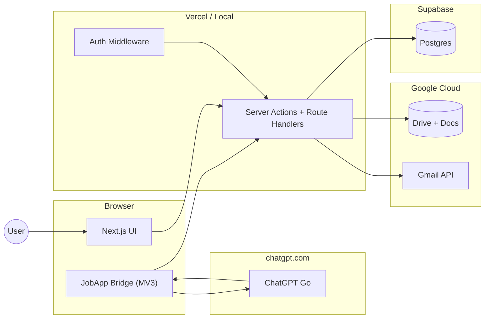

# JobApp OS — Architecture

> Companion to [`problemstatement.md`](problemstatement.md). Describes the **current shipped system** as of July 2026.

---

## 0. Executive Summary

**JobApp OS** is a hosted, multi-user web app that turns a pasted job description (plus optional contacts) into a tracked application package: tailored resume, cover letter, cold emails, Gmail drafts, and follow-ups. ChatGPT is the LLM, used via paste or the **JobApp Bridge** Chrome extension — no API keys needed.

**Design pillars:**

1. **~$0 beyond ChatGPT Go** — Supabase free tier, Vercel Hobby, Google Drive free quota  
2. **The user *is* the LLM API** — every prompt is pasted into ChatGPT (or automated by Bridge); no rate limits  
3. **Structured contracts** — every paste-back is Zod-validated; malformed responses get a repair prompt  
4. **Draft-only outbound** — Gmail drafts, never auto-send  
5. **Multi-tenant** — email/password signup; every row scoped to `user_id`

**Not in scope:** auto-submit to LinkedIn, auto-send email, interview scheduling, salary tooling, LLM API keys.

---

## 1. Stack

### Application
- **Next.js 16.2** (App Router, React 19, Server Actions, Turbopack dev)
- **Tailwind CSS 4** + custom design tokens (DESIGN.md "Command Precision")
- **Zod 4** for validation

### Data & Auth
- **Supabase Postgres** (remote; connection via `postgres` npm package)
- **Email/password auth** — `bcryptjs` passwords, `jose` JWT session cookie (`applyforge_session`, 30 days)
- **`users` + `sessions`** tables; middleware gates all non-public routes
- **Multi-tenant** — `profiles`, `applications`, `pipelines`, `google_tokens`, `extension_tokens`, etc. all keyed by `user_id`
- **Google OAuth** — Drive + Gmail scopes; separate from app login

### LLM (Paste-to-GPT)
- **Prompt Composer** — assembles prompt from template + context
- **Paste-Back Validator** — strips fences, extracts JSON, Zod validates
- **Repair Prompt Generator** — on validation fail, emits a fix prompt
- **Prompt Library** — versioned templates in `prompt_templates` table

### Outbound
- **Gmail API** — `gmail.compose` for drafts; `gmail.send` for password-reset emails from the admin Google account
- **Google Drive + Docs API** — master resume/cover sync; generated artifact storage

### Extension
- **JobApp Bridge** (Chrome MV3) — opens ChatGPT, pastes prompt, captures response, POST back, closes tab; loops through pipeline stages

### Hosting
- **Vercel** (production) or `npm run dev` (local)
- No Redis, no SQLite, no Sentry

---

## 2. System Context



---

## 3. Auth

| Layer | Mechanism |
|---|---|
| Signup / login | `bcryptjs` + `users` table; forms at `/signup`, `/login` |
| Session | JWT (`jose`) in `applyforge_session` httpOnly cookie; `sessions` table in Postgres |
| Middleware | `middleware.ts` verifies JWT on every non-public route; redirects to `/login` |
| Multi-tenant | Every query helper resolves `user_id` from session (`currentUserId()`) |
| Password recovery | Forgot-password email with one-time token (`password_reset_tokens`); `/reset-password` |
| Forced reset | `users.must_reset_password` gates into `/reset-password-required` until changed |
| Admin | `users.is_admin`; first signup on empty DB is admin; `/admin-center` for user ops |
| Google OAuth | Separate — grants Drive + Gmail access; tokens encrypted with `GOOGLE_TOKEN_ENCRYPTION_KEY` |

First signup claims orphaned legacy singleton rows (if any).

---

## 4. Data Model (key tables)

| Table | Scope | Purpose |
|---|---|---|
| `users` | PK `id` | App accounts (`is_admin`, `must_reset_password`) |
| `sessions` | FK `user_id` | Active sessions |
| `password_reset_tokens` | FK `user_id` | One-time email reset links |
| `password_reset_requests` | FK `user_id` | Recovery request audit |
| `profiles` | PK `user_id` | Name, links, avatar, setup flags |
| `master_resume` | PK `user_id` | Resume JSON + Doc sync |
| `master_cover_letter` | PK `user_id` | Cover letter Doc sync |
| `google_tokens` | PK `user_id` | Encrypted OAuth tokens |
| `extension_tokens` | PK `user_id` | JobApp Bridge bearer |
| `applications` | FK `user_id` | JD + status + notes |
| `contacts` | FK `application_id` | Recruiter contacts |
| `resume_versions` | FK `application_id` | Generated resumes |
| `cover_letter_versions` | FK `application_id` | Generated cover letters |
| `emails` | FK `application_id` | Cold emails + Gmail drafts |
| `follow_ups` | FK `application_id` | Scheduled follow-up prompts |
| `prompt_runs` | FK `user_id` | Prompt ↔ response ledger |
| `prompt_templates` | — | Versioned templates |
| `pipeline_runs` | FK `user_id` | Quick Apply pipeline state |
| `audit_log` | FK `user_id` | Event log |

Schema: [`supabase/schema.sql`](../supabase/schema.sql).

---

## 5. Quick Apply Pipeline

### Stages

```
create_application → jd_parse → resume → cover_letter
  → save_contacts → cold_email → gmail_drafts
```

### Required form fields

- **Job description** (≥ 50 characters)
- **Company** and **Role** (non-empty; validated in UI + Zod)

### Contacts are optional

- **With contacts**: all 7 stages run; cold email + Gmail drafts produce outputs
- **Without contacts**: `save_contacts`, `cold_email`, `gmail_drafts` are marked **skipped**
- Pipeline completes after cover letter when contacts are empty

### Stage statuses

`pending | running | awaiting_chatgpt | completed | failed | skipped`

### ChatGPT loop (per stage)

1. Prompt Composer builds the prompt
2. Prompt is exported → ChatGPT (via Bridge or manual paste)
3. Response pasted back → Zod validates → artifact saved
4. If invalid → repair prompt issued → user retries
5. On completion → next stage

### Concurrency

- One active pipeline per user at a time; additional starts are **queued**
- Atomic `UPDATE … WHERE status = 'pending'` prevents double-claims
- `PipelineKeeper` (client) polls; backs off when tab is idle/hidden

---

## 6. Home Setup Guide

After signup, the dashboard shows an interactive **4-step accordion** (minimizable to a floating pill):

1. **Google Cloud Console** — one-time OAuth env setup  
2. **Connect Google** — link user's Google account  
3. **Profile & master docs** — name, headline, sync resume/cover Docs  
4. **Install JobApp Bridge** — download zip or load unpacked  

Progress is tracked with a bar and per-step checkmarks. Minimize state is persisted to `profiles.setup_guide_collapsed`; **Privacy & Settings** can reopen it.

### Home layout

- Profile header with **Start Quick Apply** + **Update Profile**
- Full-width **pipeline metrics** grid + **Enqueue due follow-ups**
- No shortcut tiles for Apply / Jobs / Profile / Settings (those live in the header / Me menu)

---

## 7. UI & Theme

- **"Command Precision"** design language (LinkedIn-ish, see `DESIGN.md`)  
- Brand: **JobApp OS** logo (`public/brand/jobapp-os-logo.png`)  
- **Light + dark + system** theme; cookie `applyforge_theme`; boot script avoids flash  
- **Me dropdown** — avatar (uploaded or initials), View Profile, Privacy & Settings, theme cycle, Sign out  
- **Profile avatar** — upload on Profile page; stored in `profiles.avatar_data/avatar_mime`; served at `/api/profile/avatar`  
- **Nav**: Home · Quick Apply · Jobs (+ Admin Center) + Me avatar  
- **Search applications** — header search shown **only** on `/applications` (Jobs)  
- Client router cache (`staleTimes`) keeps visited pages instant on revisit  
- **PageLoader** — branded centered spinner on route transitions

---

## 8. App Routes

| Route | Purpose |
|---|---|
| `/` | Redirect to `/dashboard` or `/login` |
| `/login`, `/signup` | Auth |
| `/forgot-password`, `/reset-password` | Email password recovery |
| `/reset-password-required` | Forced password change after admin create / reset |
| `/dashboard` | Home, metrics, follow-ups, setup guide |
| `/apply` | Quick Apply form |
| `/applications` | Jobs list + search |
| `/applications/[id]` | Application workspace (contacts, versions, email, notes) |
| `/pipeline/[id]` | Pipeline progress UI |
| `/onboarding` | Profile, avatar, master resume/cover |
| `/prompts` | Prompts inbox |
| `/settings` | Privacy & Settings (password, extension token, bridge) |
| `/admin-center` | Admin user management |
| `/health` | Google / prompt / DB health |
| `/demo` | Paste-flow sandbox |
| `/api/health` | Public readiness check |
| `/api/auth/google/*` | Google OAuth start + callback |
| `/api/extension/*` | Bridge pending / paste-back / report-error |
| `/api/profile/avatar` | User avatar image |
| `/api/cron/*` | Tick pipelines, enqueue follow-up prompts |

---

## 9. Environment Variables

| Variable | Required | Purpose |
|---|---|---|
| `DATABASE_URL` | Yes | Supabase Postgres (pooler `:6543` for Vercel) |
| `AUTH_SECRET` | Yes | Signs session JWTs |
| `NEXT_PUBLIC_APP_URL` | Yes | Public app URL |
| `GOOGLE_OAUTH_CLIENT_ID` | Yes | OAuth client |
| `GOOGLE_OAUTH_CLIENT_SECRET` | Yes | OAuth secret |
| `GOOGLE_OAUTH_REDIRECT_URI` | Yes | Must match Google Console |
| `GOOGLE_TOKEN_ENCRYPTION_KEY` | Yes | Encrypts stored Google tokens |
| `RESUME_MASTER_DOC_ID` | No | Default master resume Doc |
| `COVER_LETTER_MASTER_DOC_ID` | No | Default cover letter Doc |

---

## 10. Google Integration

### OAuth flow

1. User clicks **Connect Google** on Home  
2. App redirects to Google consent (both Gmail + Drive scopes)  
3. Google callback → app exchanges code → encrypts tokens → stores in `google_tokens`  
4. Tokens refresh transparently; `invalid_grant` triggers a "Reconnect Google" banner

### Drive file layout

```
Job Application Automation/
├── {Company} - {Role}/
│   ├── Resume_v1.pdf / .docx
│   └── Cover_Letter_v1.pdf / .docx
└── Master Resume/
    └── (synced from user's Doc)
```

### Gmail

- **Draft-only for outreach** (scope `gmail.compose`)
- **Password reset emails** use `gmail.send` from a connected admin Google account
- Cold email → Gmail draft with resume PDF attachment
- Follow-up → Gmail draft

---

## 11. Migrations & Scripts

| Script | Purpose |
|---|---|
| `supabase/schema.sql` | Full schema (new deploys) |
| `web/scripts/migrate-auth-multitenant.mjs` | Adds `users`, `sessions`, scopes existing tables (v44) |
| `web/scripts/migrate-setup-guide.mjs` | `setup_console_done_at`, `setup_guide_collapsed` (v45) |
| `web/scripts/migrate-profile-avatar.mjs` | `avatar_data`, `avatar_mime` (v46) |
| `web/scripts/migrate-admin-auth.mjs` | `is_admin`, `must_reset_password`, password reset tables (v47) |
| `web/scripts/migrate-manual-payments.mjs` | `is_paid`, `paid_at`, `payment_claims` (v48) |
| `web/scripts/promote-admin-user.mjs` | Set `is_admin` for an email |
| `web/scripts/seed-prompt-templates.mjs` | Loads `_prompt_templates.json` into `prompt_templates` |
| `web/scripts/pack-extension-zip.mjs` | Packs `extension/` → `public/downloads/jobapp-bridge.zip` |

---

## 12. Change Log

- **v1.2** — **Manual UPI paywall.** Unpaid users gated to `/billing`; submit UTR for admin approval. Admins can approve/reject claims or mark paid / revoke access.
- **v1.1** — **JobApp OS branding**, Admin Center, email password recovery, forced resets. Quick Apply requires company + role. Home simplified (metrics + follow-ups; Update Profile CTA). Header search only on Jobs. Privacy & Settings rename. Gmail `gmail.send` for reset emails.
- **v1.0** — **Multi-user hosted deploy.** Email/password auth, `user_id` scoping, Supabase Postgres, Vercel-ready. Home setup guide with minimize/pill. Optional contacts in Quick Apply (cold email + Gmail skipped when empty). Theme (light/dark/system). Profile avatar upload. Me dropdown. Client router caching for instant revisits.
- **v0.5** — **Local-first pivot.** Dropped Supabase + app login in favour of SQLite.
- **v0.4** — Removed Upstash Redis.
- **v0.3** — Google Drive replaces Cloudflare R2. Mailmeteor paste-back replaces discovery chains. Gmail API replaces SMTP.
- **v0.2** — ChatGPT Go paste-to-GPT flow replaces free LLM APIs. Prompt Composer + Paste-Back Bridge. Phase 8 Chrome extension.
- **v0.1** — Initial architecture from problem statement.
