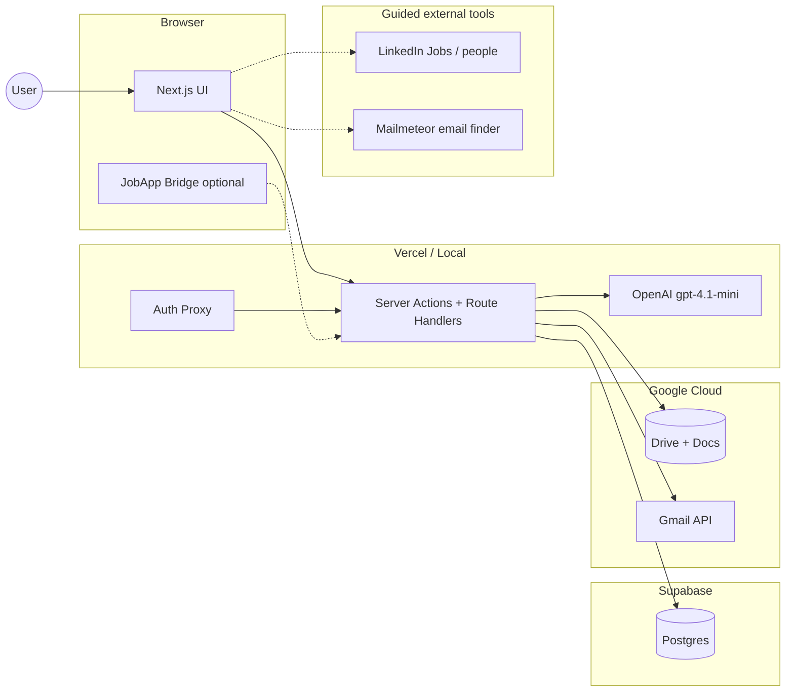

# JobApp OS — Architecture

> Companion to [`problemstatement.md`](problemstatement.md). Describes the **current shipped system** as of August 2026.

---

## 0. Executive Summary

**JobApp OS** is a hosted, multi-user web app that turns a pasted job description (plus optional contacts) into a tracked application package: tailored resume, cover letter, cold emails, Gmail drafts, and follow-ups.

**LLM path (default):** generations run **server-side** via OpenAI **`gpt-4.1-mini`** (API key in env). The pipeline advances without ChatGPT tabs for the Apply flow.

**Legacy path:** **JobApp Bridge** + ChatGPT paste remains supported for fallback / older runs (`llm_engine` legacy ids such as `gemma` normalize to `openai` at read time).

**Design pillars:**

1. **Draft-only outbound** — Gmail drafts for outreach; never auto-send cold email  
2. **Structured contracts** — every LLM response is Zod-validated; malformed JSON gets a repair pass  
3. **Grounded generation** — resume/cover anchored to master materials; fabrication checks; **≥70% grounded JD keyword coverage** required on resume accept  
4. **Layout lock** — each experience/project bullet keeps the **same Google Doc wrap line count** as master (estimator + auto-fit); one-page PDF  
5. **Artifacts before drafts** — Drive PDFs for resume/cover must be ready before Gmail draft attachments  
6. **Multi-tenant** — email/password signup; every row scoped to `user_id`  
7. **Setup gate** — paid users unlock Dashboard/Apply only after Google + required profile fields + master resume  
8. **India time** — UI timestamps, metrics day bounds, and follow-up business days use **IST (`Asia/Kolkata`)**

**Not in scope:** auto-submit to LinkedIn/ATS, auto-send outreach email, interview scheduling, salary tooling. Recruiter email discovery is **guided** (LinkedIn + [Mailmeteor LinkedIn Email Finder](https://mailmeteor.com/tools/linkedin-email-finder)), not scraped/automated inside the product.

---

## 1. Stack

### Application
- **Next.js 16.2** (App Router, React 19, Server Actions, Turbopack dev)
- **Tailwind CSS 4** + custom design tokens (DESIGN.md "Command Precision")
- **Zod 4** for validation

### Data & Auth
- **Supabase Postgres** (remote; connection via `postgres` npm package)
- **Email/password auth** — `bcryptjs` passwords, `jose` JWT session cookie (`applyforge_session`, 30 days)
- **`users` + `sessions`** tables; proxy gates all non-public routes
- **Multi-tenant** — `profiles`, `applications`, `pipelines`, `google_tokens`, `extension_tokens`, etc. all keyed by `user_id`
- **Google OAuth** — Drive + Gmail scopes; separate from app login

### LLM
- **OpenAI Chat Completions** — `web/src/lib/llm/openai.ts` (`OPENAI_MODEL_ID = gpt-4.1-mini`)
- Env: `CHATGPT_API_KEY` or `OPENAI_API_KEY`
- Stages: `jd_parse`, `resume`, `cover_letter`, `cold_email` (+ schema repair rounds)
- **Prompt Composer** + versioned `prompt_templates` + Zod paste-back / repair
- **Legacy Bridge path** — optional Chrome extension for ChatGPT UI automation

### Outbound & files
- **Gmail API** — `gmail.compose` for drafts; `gmail.readonly` for thread lookup; `gmail.send` for admin password-reset / payment-claim emails
- **Google Drive + Docs API** — master resume/cover sync; Docs copy → export PDF → upload; pipeline page download links

### Hosting
- **Vercel** (production) or `npm run dev` (local)
- No Redis, no SQLite, no Sentry

---

## 2. System Context



---

## 3. Auth

| Layer | Mechanism |
|---|---|
| Signup / login | `bcryptjs` + `users` table; forms at `/signup`, `/login` |
| Session | JWT (`jose`) in `applyforge_session` httpOnly cookie; `sessions` table in Postgres |
| Proxy | `proxy.ts` verifies JWT on every non-public route; redirects to `/login` |
| Multi-tenant | Every query helper resolves `user_id` from session (`currentUserId()`) |
| Password recovery | Forgot-password email with one-time token; `/reset-password` |
| Forced reset | `users.must_reset_password` → `/reset-password-required` |
| Admin | `users.is_admin`; first signup on empty DB is admin; `/admin-center` |
| Paid access | `users.is_paid` / `paid_at`; unpaid users gated to `/billing` (admins treated as paid) |
| Setup readiness | `getSetupReadiness()` — Google connected + profile (name, location, phone, LinkedIn) + master resume; locks Dashboard/Apply until ready |
| Google OAuth | Separate — Drive + Docs + Gmail; tokens encrypted with `GOOGLE_TOKEN_ENCRYPTION_KEY` |
| App timezone | `Asia/Kolkata` (`web/src/lib/datetime/india.ts`) for display, metrics ranges, follow-up business days |

---

## 4. Data Model (key tables)

| Table | Scope | Purpose |
|---|---|---|
| `users` | PK `id` | Accounts (`is_admin`, `must_reset_password`, `is_paid`, `paid_at`) |
| `sessions` | FK `user_id` | Active sessions |
| `password_reset_tokens` | FK `user_id` | One-time email reset links |
| `payment_claims` | FK `user_id` | Legacy manual UPI payment reviews |
| `razorpay_payment_links` | FK `user_id` | Razorpay Payment Link rows (`created` / `paid` / …) |
| `profiles` | PK `user_id` | Name, location, phone, links, avatar; timezone defaults to `Asia/Kolkata` |
| `master_resume` | PK `user_id` | Resume JSON + Doc sync |
| `master_cover_letter` | PK `user_id` | Cover letter Doc sync |
| `google_tokens` | PK `user_id` | Encrypted OAuth tokens |
| `extension_tokens` | PK `user_id` | JobApp Bridge bearer (optional) |
| `applications` | FK `user_id` | JD + status + notes |
| `contacts` | FK `application_id` | Recruiter contacts |
| `resume_versions` / `cover_letter_versions` | FK `application_id` | Generated artifacts + Drive file ids |
| `emails` | FK `application_id` | Cold emails + Gmail drafts |
| `follow_ups` | FK `application_id` | Scheduled follow-up prompts |
| `prompt_runs` | FK `user_id` | Prompt ↔ response ledger |
| `prompt_templates` | — | Versioned templates |
| `pipeline_runs` | FK `user_id` | Quick Apply state (`llm_engine`, stages JSON) |
| `audit_log` | FK `user_id` | Event log |

Schema: [`supabase/schema.sql`](../supabase/schema.sql).

**Note:** Application **quota metering** (e.g. launch offer “60 Apply runs”) is **product messaging** as of this doc revision; enforcement is planned with tiered pricing infrastructure. Lifetime **product** access remains via `is_paid`.

---

## 5. Quick Apply Pipeline

### Stages

```
create_application → jd_parse → resume → cover_letter
  → save_contacts → cold_email → gmail_drafts
```

Default engine: **`openai`** (`normalizePipelineLlmEngine` maps legacy `gemma` → `openai`).

### Required form fields

- Job description (≥ 50 characters)
- Company and Role (non-empty)

### Contacts (optional)

- **With contacts:** cold email + Gmail drafts run  
- **Without:** `save_contacts`, `cold_email`, `gmail_drafts` are **skipped**  
- Apply UI includes a collapsible **contact finder guide** (LinkedIn recruiters → Mailmeteor LinkedIn Email Finder → paste emails into the form). Aim for 2–3 contacts when possible.

### Cover letter toggle

- User can skip cover letter (`skip_cover_letter`) for a faster run.
- **Default:** cover letter is **off** until a master cover letter is synced; enabling Yes without a synced template is blocked with an in-app hint.

### AI stage loop (OpenAI)

1. Prompt Composer builds the prompt from active template + context  
2. `generateWithOpenAI` calls Chat Completions (retries on transient API errors)  
3. Response Zod-validated → artifact saved  
4. On schema / keyword-floor failure → repair prompt → limited repair rounds (resume up to **2** keyword/structure repairs)  
5. Resume/cover Docs export runs deferred (`after()`); cover marks PDF ready before DOCX finishes so Gmail is not blocked on Word export  

### Drive PDFs before Gmail drafts

Before `gmail_drafts` creates drafts with attachments:

1. Pipeline waits until resume (and cover, if not skipped) PDFs are **uploaded and ready** in Drive  
2. Progress surfaces messages such as waiting for Drive PDFs / upload delays  
3. If uploads fail or time out, the drafts stage fails with a clear error rather than sending drafts without attachments  
4. Export path: copy master Doc → replace slots → optional style pass → `exportAsPdf` → upload PDF (cover also exports DOCX in parallel; PDF readiness unblocks drafts early). Folder lookups are cached per request.

### Stage statuses

`pending | running | awaiting_chatgpt | completed | failed | skipped`

(`awaiting_chatgpt` remains for Bridge/manual paste path.)

### Concurrency

- One active pipeline per user; additional starts may be **queued**  
- Atomic stage claims prevent double-runs  
- `PipelineKeeper` polls; backs off when the tab is idle  

### Content rules (prompts + validators)

- **Resume primary goal:** maximize **grounded** JD keywords (must-have + tech) by rewriting master points in JD language — **≥70% coverage required** before accept (`JD_KEYWORD_COVERAGE_MIN`; required count capped by keywords already present in master so unfamiliar tools are not invented)  
- **Resume hard constraint:** each experience/project bullet must keep the **same Doc wrap line count** as its master bullet (neither more nor fewer). Enforced in prompts and post-process (`estimateWrapLineCount` + `fitBulletToMasterWrapLines`); word-budget shrink cannot drop below master wrap lines  
- **Skills:** same line count as master; reorder/swap within Category (or flat) shape; no invented Category prefixes  
- **Cover letter:** JSON body sections only — **no greeting / sign-off** (template provides both); validators strip residual sign-offs  

---

## 6. Dashboard & Profile setup

### Setup gate (not a dashboard checklist)

Paid users are redirected / locked out of Dashboard and Apply until setup readiness is true:

1. **Connect Google** (Drive + Docs + Gmail scopes)  
2. **Profile fields** — full name, location, phone, LinkedIn  
3. **Master resume** synced with content  

UI lives on **`/onboarding` (Profile)** with a minimizable setup progress chip next to the Google account menu. Profile and master docs remain editable anytime after unlock.

### Dashboard layout (current)

1. **Profile hero** — Start Apply, Update Profile, status chips  
2. **Fresh jobs banner** — LinkedIn last-hour filter hack (`f_TPR=r3600`); CTA opens LinkedIn Jobs  
3. Pending-prompts alerts when relevant  
4. **Pipeline metrics** (date-filtered in **IST**):
   - Total applications  
   - This week  
   - Gmail drafts  
   - Companies contacted  
   - Presets: Last 7 days / 30 days (default) / 3 months / Custom  
5. **Recent applications** + **Quick actions**

Logic: `parseMetricsRange`, `getDashboardMetricsRow`, `mapDashboardMetrics`, `lib/datetime/india.ts`.

---

## 7. Marketing site (public `/`)

- Landing sections: About, Features, Benefits, **Insider tips** (last-hour jobs + email finder), AI, Gallery, **Pricing**, **FAQ**  
- Hero and page metadata describe JobApp OS as a **job application automation** product (resumes, cover letters, Google Drive/Docs, Gmail drafts, tracking)  
- Header includes a **Privacy** link; footer links Privacy Policy + Terms (URLs must match OAuth consent screen for Google brand verification)  
- **Launch offer messaging:** ₹299 for the **first 100 buyers** — **lifetime product access** + **60 applications included**; strike ₹699; DIY comparison callout under pricing  
- FAQ covers drafts-only, Google scopes, fabrication, no user API keys, ATS-friendly PDFs, runtime, cold email norms, failed-stage repair  

---

## 8. UI & Theme

- **"Command Precision"** design language (see `DESIGN.md`)  
- Brand: **JobApp OS** (`public/brand/jobapp-os-logo.png`)  
- Light + dark + system theme (`applyforge_theme`)  
- Desktop nav: Dashboard · Apply · Jobs (+ Admin) + Me  
- Mobile: bottom tabs + compact header  
- Billing: Razorpay Payment Links + webhook unlock; Admin Center recent links + Mark paid  

---

## 9. App Routes

| Route | Purpose |
|---|---|
| `/` | Marketing landing (or redirect when logged in, per app layout) |
| `/login`, `/signup` | Auth |
| `/forgot-password`, `/reset-password` | Email password recovery |
| `/reset-password-required` | Forced password change |
| `/dashboard` | Metrics, fresh-jobs banner, recent apps (requires setup ready) |
| `/apply` | Quick Apply (+ contact finder guide; requires setup ready) |
| `/applications` | Jobs list + search |
| `/applications/[id]` | Application workspace |
| `/pipeline/[id]` | Live pipeline progress + PDF downloads |
| `/onboarding` | **Profile** — Google connect, profile fields, master resume/cover |
| `/prompts` | Prompts inbox |
| `/settings` | Privacy & Settings (password / account; links to Profile) |
| `/billing` | Razorpay Payment Link paywall (launch offer) |
| `/billing/razorpay/return` | Post-payment confirm / poll until unlocked |
| `/review-payment/[token]` | Legacy signed mobile UPI claim review |
| `/admin-center` | Admin users, Mark paid, Razorpay links, legacy UPI claims |
| `/privacy-policy`, `/terms` | Legal |
| `/health` | Google / prompt / DB health |
| `/demo` | Paste-flow sandbox |
| `/api/health` | Public readiness |
| `/api/auth/google/*` | Google OAuth |
| `/api/billing/razorpay/webhook` | Razorpay webhook (public; signature verified) |
| `/api/extension/*` | Bridge pending / paste-back / report-error |
| `/api/pipeline/[id]/status` | Pipeline status polling |
| `/api/cron/*` | Tick pipelines, enqueue follow-ups |

---

## 10. Environment Variables

| Variable | Required | Purpose |
|---|---|---|
| `DATABASE_URL` | Yes | Supabase Postgres (pooler `:6543` on Vercel) |
| `AUTH_SECRET` | Yes | Session JWTs + payment-review tokens |
| `NEXT_PUBLIC_APP_URL` | Yes | Public app URL |
| `GOOGLE_OAUTH_CLIENT_ID` / `_SECRET` / `_REDIRECT_URI` | Yes | OAuth |
| `GOOGLE_TOKEN_ENCRYPTION_KEY` | Yes | Encrypts Google tokens |
| `CHATGPT_API_KEY` or `OPENAI_API_KEY` | Yes (Apply) | OpenAI server generations |
| `RAZORPAY_KEY_ID` / `RAZORPAY_KEY_SECRET` | Yes (billing) | Payment Links API |
| `RAZORPAY_WEBHOOK_SECRET` | Yes (billing) | Webhook HMAC |
| `NEXT_PUBLIC_PAYMENT_AMOUNT_INR` | No | Default `299` |
| `NEXT_PUBLIC_PAYMENT_PLAN_LABEL` | No | Default launch-offer label (60 apps · lifetime access) |
| `NEXT_PUBLIC_UPI_ID` | No | Legacy UPI fallback VPA |
| `ADMIN_NOTIFY_EMAIL` | No | Legacy payment-claim alert recipients |
| `CRON_SECRET` | No | Bearer for `/api/cron/*` |
| `RESUME_MASTER_DOC_ID` / `COVER_LETTER_MASTER_DOC_ID` | No | Default master Docs |

---

## 11. Google Integration

### OAuth

Connect Google on **Profile** (`/onboarding`) → consent (Gmail + Drive + Docs) → encrypted tokens in `google_tokens`. Refresh / `invalid_grant` → reconnect via the Google account menu. Required for setup readiness.

### Drive layout

```
Job Application Automation/
├── {Company} - {Role}/
│   ├── Resume_v….pdf
│   └── Cover_Letter_v….pdf
└── Master Resume/
```

### Gmail

- Outreach: **drafts only** (`gmail.compose`), with resume/cover PDFs attached when ready  
- Follow-ups: draft replies in-thread when possible  
- Admin: `gmail.send` for password reset + payment-claim alerts  

---

## 12. Billing (current commercial stance)

| Item | Value |
|---|---|
| Launch price | **₹299** one-time |
| Audience | First **100** buyers (messaging) |
| Access | **Lifetime** product access after successful payment (auto-unlock) |
| Included Apply volume | **60** applications (messaging; metering TBD) |
| Payment (primary) | Razorpay **Payment Link** → redirect → webhook `payment_link.paid` / `payment.captured` → `setUserPaid` |
| Return UX | `/billing/razorpay/return` (optional callback signature fast path + poll) |
| Support override | Admin **Mark paid / unpaid** |
| Legacy | Collapsed manual UPI + `payment_claims` |
| Future | Tiered packs / top-ups after usage data |

Implementation guide: [`razorpay-payment-links.md`](razorpay-payment-links.md).

COGS note: OpenAI `gpt-4.1-mini` is ~₹2–₹2.5 per typical full Apply (prompt-heavy). Cap exists to protect margin under unlimited power use.

---

## 13. Migrations & Scripts

| Script / path | Purpose |
|---|---|
| `supabase/schema.sql` | Full schema |
| `web/scripts/migrate-*.mjs` | Incremental auth, setup, avatar, admin, payments |
| `web/scripts/seed-prompt-templates.mjs` | Load templates |
| `web/scripts/activate-resume-v30.mjs` | Activate resume prompt v30 (JD rewrite + ≥70% keywords + wrap lock) |
| `web/scripts/pack-extension-zip.mjs` | Bridge zip for downloads |
| `web/db/migrations/*.sql` | Prompt / feature SQL migrations (e.g. cover sign-off, resume replace) |
| `web/scripts/ab-pdf-bench.ts` | A/B Docs export vs server `pdf-lib` timing (ops/research) |

---

## 14. Change Log

- **v1.9** — **Razorpay Payment Links** as primary billing (redirect + signed webhook → `is_paid`); return poller; Admin recent links; manual UPI nested as legacy. Guide: `docs/razorpay-payment-links.md`.
- **v1.8** — Resume quality: **JD-framed rewrite** (not timid token swaps); hard **≥70% grounded JD keyword coverage** on accept with repair loops; **strict same Doc wrap line count** per bullet (width estimator + auto-fit); skills merge/normalize fixes; faster Drive PDF path (parallel cover export, PDF-ready before DOCX, folder cache, skip unused skill style pass). Active template `resume_v30_gdoc`.
- **v1.7** — **Profile setup gate** (Google + profile fields + master resume) replaces dashboard setup guide; Profile page rename (editable anytime). App-wide **IST** for display, metrics, follow-ups. Cover letter Apply default **off** until master cover synced; cover sign-off sync hardened. Landing/legal copy for Google brand verification (purpose + Limited Use). Privacy Policy & Terms refreshed (August 2026).
- **v1.6** — **OpenAI server Apply** as default (`gpt-4.1-mini`); Gemma/NVIDIA naming removed (legacy engine ids normalize to `openai`). **Wait for Drive PDFs** before Gmail drafts. Dashboard: four metrics + date filter, fresh-jobs banner, recent apps, quick actions. Apply: Mailmeteor contact guide. Landing: Insider tips, FAQ, launch pricing (₹299 / first 100 / 60 apps / lifetime access). Cover sign-off stripping + resume in-place keyword replace prompts.
- **v1.5** — Follow-up threading; Gmail readonly for sent lookup; auto-advance `email_sent` on cold-email draft.
- **v1.4** — Follow-up threading details (see prior).
- **v1.3** — Mobile-ready UI; legal pages; billing QR + phone review; Admin ⋮ menu.
- **v1.2** — Manual UPI paywall.
- **v1.1** — JobApp OS branding, Admin Center, company+role required on Apply.
- **v1.0** — Multi-user hosted deploy.
- **v0.x** — Earlier local/SQLite/ChatGPT-only iterations (see git history).
