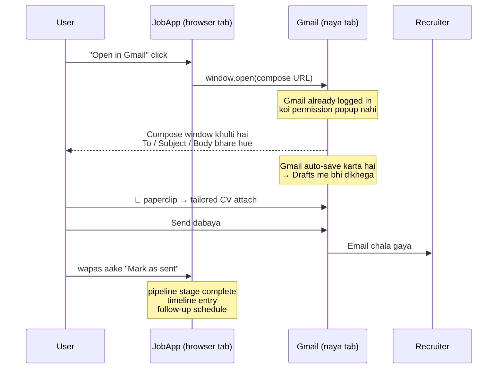

# Manual send flow — Gmail API ke bina email bhejna

Ye doc explain karta hai ki `gmail.compose` scope hataane ke baad cold email kaise
bhejenge: **compose deep link**. Link kya hai, click karne pe exactly kya hota hai,
attachment ka kya hoga, uske baad app kya track karega, aur kahan-kahan phasoge.

---

## 1. Problem kya hai

Abhi app Gmail API se draft banata hai (`web/src/app/actions/emails.ts:778`):

```
gmail.users.drafts.create({ to, subject, bodyHtml, attachments })
```

Iske liye `https://www.googleapis.com/auth/gmail.compose` scope chahiye
(`web/src/lib/google/oauth.ts:6`). Google ki classification me ye **restricted
scope** hai — sabse upar wala tier.

| Scope tier | Verification | Security assessment (CASA) |
|---|---|---|
| Non-sensitive (`drive.file`) | nahi chahiye | nahi |
| Sensitive (`documents`) | chahiye (free, review) | nahi |
| **Restricted (`gmail.compose`)** | **chahiye** | **chahiye — annual, paid** |

CASA ek third-party security audit hai jo har saal dobara karana padta hai.
Tumne jo ~$5,000 suna hai wo isi ka number hai. **Testing mode me 100 users tak
ye lagta hi nahi** — isliye abhi sab chal raha hai. Dikkat public launch pe aayegi.

Toh sawaal ye hai: **bina kisi Gmail permission ke, user ke Gmail me ek bhara hua
email kaise khol dein?**

Jawab: URL se. Ye Gmail API nahi hai — ye sirf ek link hai.

---

## 2. Do tarah ke link

### A. Gmail compose deep link (Gmail users ke liye)

```
https://mail.google.com/mail/?view=cm&fs=1&to=recruiter@acme.com&su=SUBJECT&body=BODY
```

| Parameter | Matlab |
|---|---|
| `view=cm` | "compose mode" — naya email likhne ki window kholo |
| `fs=1` | full-screen compose (chhoti popup window ke bajaye) |
| `to` | recipient. Comma se multiple bhi de sakte ho |
| `cc`, `bcc` | optional |
| `su` | **subject** (Gmail `su` use karta hai, `subject` nahi) |
| `body` | email ka body — **sirf plain text** |

Account chunne ke liye `/mail/u/0/` bhi laga sakte ho:
`https://mail.google.com/mail/u/0/?view=cm&fs=1&...`
(`u/0` = browser me pehla logged-in Google account.)

### B. `mailto:` (sabke liye — Outlook, Apple Mail, Thunderbird, company email)

```
mailto:recruiter@acme.com?subject=SUBJECT&body=BODY
```

Ye OS/browser ke **default mail handler** ko kholta hai. Agar user ke laptop pe
Outlook set hai to Outlook khulega, Gmail set hai to Gmail. Ye standard hai
(RFC 6068), har jagah kaam karta hai.

### Dono me common baat

**Body clipboard me copy nahi hota — wo seedha compose box me *type* hoke aa
jaata hai.** User ko paste bhi nahi karna. Window khulte hi To, Subject aur Body
teeno bhare hue milte hain.

---

## 3. Click karne ke baad exactly kya hota hai



Step by step:

1. **User "Open in Gmail" dabata hai.** Naya tab khulta hai.
2. **Gmail khulta hai — already logged in.** Koi OAuth screen nahi, koi
   "allow access" nahi, kuch bhi nahi. Kyunki ye API call nahi hai, sirf ek URL hai.
3. **Compose window pehle se bhari hui hai** — To, Subject, Body.
4. **Gmail apne aap draft save kar leta hai.** Kuch seconds me wo email Gmail ke
   Drafts folder me aa jaata hai. Matlab **end result wahi hai jo API se milta tha**
   — ek Gmail draft — bas raasta doosra hai.
5. **User attachment lagata hai** (agla section dekho).
6. **Send dabata hai.** Email user ke apne Gmail se jaata hai, apne signature ke
   saath, apne "Sent" folder me record hota hai.
7. **User wapas app me aake "Mark as sent" dabata hai** taaki app ko pata chale.

---

## 4. Attachment — sach ye hai ki URL se nahi ja sakta

**Koi bhi URL scheme file attach nahi kar sakta.** `mailto:` spec me `attach`
parameter jaan-boojh ke mana hai, aur Gmail ke compose URL me bhi aisa koi
parameter nahi hai.

**Kyun?** Security. Agar ye possible hota to koi bhi website ek link bana ke
tumhare laptop se koi bhi file chupke se email me lagwa sakti thi. Isliye
browser file system ko kabhi URL ke through touch nahi karne deta.

Toh CV ke liye teen raaste hain:

### Option 1 — Download karo, phir attach karo (recommended)

App me ek button: **"Download tailored CV"**. Endpoint already exist karta hai:

```
/api/applications/[id]/resume/[version]/pdf
/api/applications/[id]/cover-letter/[version]/pdf
```

File already sahi naam se aati hai (`Nirpendra_Mishra_Resume_Acme_PM_v2.pdf` —
`web/src/lib/emails/attachment-names.ts`).

User flow: Download CV → Open in Gmail → 📎 → file chuno → Send.
**Ek extra step, par recruiters ko attachment hi chahiye hota hai.**

### Option 2 — Body me Drive ka link

CV to already Drive me pada hai (`resume.drive_pdf_id`). Uska share link body me
daal do:

```
Resume: https://drive.google.com/file/d/<id>/view
```

Isme **zero manual step** hai. Lekin:
- File ko "anyone with the link can view" karna padega (`drive.file` scope se
  ye ho sakta hai, kyunki file app ne khud banayi hai)
- Bahut se recruiters/ATS link follow nahi karte, attachment expect karte hain
- Kuch corporate firewalls Drive links block karte hain

App me ye fallback already hai — jab attachment 24MB se bada ho jaata hai to
code Drive link laga deta hai (`emails.ts:707`).

### Option 3 — Dono (mera suggestion)

Default: download + attach. Body ke end me Drive link bhi automatically —
"Resume PDF attached, backup link: ...". Recruiter ke paas dono option.

---

## 5. Encoding — yahan bugs paida hote hain

Har value ko `encodeURIComponent()` se guzarna **zaroori** hai:

```js
const url =
  "https://mail.google.com/mail/?view=cm&fs=1" +
  `&to=${encodeURIComponent(to)}` +
  `&su=${encodeURIComponent(subject)}` +
  `&body=${encodeURIComponent(bodyPlainText)}`;
```

Agar nahi kiya to:

| Body me ye hai | Bina encoding ke kya hoga |
|---|---|
| `&` (jaise "R&D") | URL wahin toot jaayega, body aadhi aayegi |
| newline | space ban jaayegi, poora email ek paragraph |
| `#` | uske baad ka sab kuch gayab |
| `+` | space ban jaayega |
| `?` | naya parameter samajh liya jaayega |

Newlines: `%0A` (Gmail ke liye theek), `mailto:` ke liye `%0D%0A` (CRLF) zyada safe hai.

**Aur ek badi baat: body param plain text hi leta hai, HTML nahi.** Abhi app
`markdownToEmailHtml()` se bold/links wala HTML banata hai
(`emails.ts:766`). Wo formatting deep link me nahi jaayegi. Do raaste:
- Cold email ko plain text hi rakho (waise bhi plain cold emails better perform karte hain), ya
- Ek alag **"Copy body (formatted)"** button do jo clipboard me `text/html`
  daale — user compose me paste karega to bold/links bach jaayenge.

---

## 6. Gotchas — ek-ek karke

### Gotcha 1: URL ki lambai ki limit hai

Ye sabse practical problem hai. Link jitna lamba, utna risk.

| Jagah | Practical limit |
|---|---|
| `mailto:` on Windows (Outlook handler) | ~2,000 characters |
| Gmail compose URL (browser → Google) | ~8,000 characters |
| Chrome address bar | bahut zyada, par handler pe aake ruk jaata hai |

Ek normal cold email 800–1,500 characters ka hota hai → **theek hai**. Par
encoding ke baad size badhta hai (har newline 3 char, har space 3 char ban
sakta hai), aur signature bhi add hota hai. Lamba email + signature 2,000 cross
kar sakta hai, aur tab **body chup-chaap kat jaayegi** — koi error nahi aayega,
bas aadha email milega. Ye sabse khatarnak failure hai kyunki dikhta nahi.

**Fix:** URL banane ke baad `url.length` check karo. Limit cross ho rahi ho to
button ko badal do — sirf To + Subject prefill karo aur body ke liye "Copy body"
dikhao, ek chhote note ke saath ("email lamba hai, body copy karke paste karo").

### Gotcha 2: Scope hatana hai to poora hatana padega

Ye sabse zaroori baat hai. **CASA assessment tab lagta hai jab app restricted
scope *maangta* hai** — chahe wo optional ho, chahe sirf kuch users use karein,
chahe incremental authorization ho.

Matlab agar tum "manual default rakho, Gmail optional" karoge to **$5k phir bhi
lagega.** Bachne ke liye `GOOGLE_USER_SCOPES` se `gmail.compose` **nikalna hi
padega**. Code bhale hi rehne do (env flag ke peeche), par production consent
screen se wo scope gayab hona chahiye.

Uske baad bachte hain:

| Scope | Tier | Kya chahiye |
|---|---|---|
| `drive.file` | non-sensitive | kuch nahi |
| `documents` | sensitive | free verification, koi paisa nahi |

**Bonus:** Docs API `drive.file` scope bhi accept karta hai app ki apni banayi
hui files ke liye. Agar test karke confirm ho jaaye to `documents` bhi hata
sakte ho, aur app **poori tarah non-sensitive** ho jaayega — verification hi
nahi chahiye. Ye alag se test karne layak hai, andaze se mat hatana.

### Gotcha 3: Password reset aur payment emails band ho jaayenge

Ye wo cheez hai jo miss ho jaati hai. App **do jagah** Gmail use karta hai:

1. User ka cold email → user ke apne Gmail se (ye hum badal rahe hain)
2. **App ke apne transactional emails → admin ke Gmail se**

Doosra wala yahan hai — `web/src/lib/google/admin-gmail.ts:58`:

```js
if (!sender.scope.includes("gmail.compose")) {
  throw new AdminGmailConfigError("Admin Google account needs Gmail compose access...");
}
```

Iske upar chal rahe hain:
- **Password reset email** (`lib/auth/password-reset-email.ts`)
- **Payment claim email** (`lib/billing/payment-claim-email.ts`)

Scope hatate hi **user password reset nahi kar payega** aur payment confirmation
nahi jaayegi. Ye pehle solve karna hoga:

- **Resend / Postmark / AWS SES** — proper transactional provider. Free tier is
  volume ke liye kaafi hai, deliverability behtar, Google pe dependency zero.
  Setup: domain verify + API key. **Ye sahi long-term jawab hai.**
- **Ya:** ek alag Google Cloud project + alag OAuth client, sirf `gmail.compose`
  ke saath, testing mode me, jisme sirf tumhara apna admin account test user
  ho. Free hai aur legal hai (testing mode 100 users allow karta hai), par
  jugaadu hai.

### Gotcha 4: Follow-up ab thread me reply nahi karega

Abhi follow-up asli reply hota hai — code `threadId` aur `rfcMessageId` bhejta
hai (`emails.ts:786`), isliye recruiter ko purane email ke neeche hi aata hai.

Deep link se ye nahi ho sakta — `In-Reply-To` header URL se set nahi hota.
Follow-up ek naya email banega.

**Kitna bura hai?** Zyada nahi. Subject me `Re: <original subject>` daal do —
Gmail aur Outlook dono subject ke basis pe kaafi haad tak thread kar dete hain.
Recruiter ko context mil jaayega.

Aur waise bhi **reply detection abhi bhi nahi hai** — `gmail.compose` inbox
padh hi nahi sakta, sirf `gmail.readonly` padh sakta. `auto-status` sirf
`gmail_draft_created` ko ek signal maanta hai
(`lib/applications/auto-status.ts:10`), reply ko nahi. Toh yahan kuch khone ko
hai hi nahi.

### Gotcha 5: App ko pata nahi chalega ki email gaya ya nahi

API wale flow me app ko draft id milta tha. Ab kuch nahi milega. Iske bina:
- pipeline ka `gmail_drafts` stage kabhi complete nahi hoga
- application timeline khaali rahegi
- follow-up kab schedule karna hai — pata nahi

**Fix:** har email card pe ek **"Mark as sent"** button. Dabate hi
`sent_at` set ho, stage complete ho, timeline entry bane, aur follow-up ka
din schedule ho jaaye. Ye choti cheez hai par iske bina aadha product mar jaata hai.

### Gotcha 6: Multiple Google accounts

`/mail/u/0/` hamesha **browser ka pehla logged-in account** kholta hai. Agar
user ke paas personal + work dono Gmail hain, to galat account me compose khul
sakta hai — aur wo galti se work email se apply kar dega.

**Fix:** `/mail/u/0/` mat use karo, plain `https://mail.google.com/mail/?view=cm`
use karo aur Google ko khud decide karne do. Ya settings me user se poochho ki
konsa account default hai.

### Gotcha 7: `mailto:` kabhi-kabhi kuch nahi karta

Agar user ke machine pe koi default mail client set hi nahi hai, `mailto:` click
karne pe **kuch nahi hota** — koi error bhi nahi. User ko lagega button toota hai.

**Fix:** `mailto:` ko kabhi akela mat rakho. Uske saath hamesha "Copy subject" /
"Copy body" buttons rakho, aur ek chhoti line: "kuch nahi khula? neeche se copy
kar lo."

### Gotcha 8: Batch me 5 tabs ek saath nahi khulenge

"Open all in Gmail" 5 contacts ke liye 5 `window.open()` karega → browser ka
**popup blocker** pehle ke baad sab block kar dega.

**Fix:** ek-ek karke. "Contact 1 of 5 → Open in Gmail → Mark as sent → Next"
wala stepper. Isse user ko pata bhi rehta hai ki kitne bache hain.

---

## 7. Purana vs naya — seedha comparison

| | Gmail API draft (abhi) | Compose deep link (naya) |
|---|---|---|
| Google scope | `gmail.compose` (restricted) | **koi nahi** |
| Saalana cost | ~$5,000 CASA | **$0** |
| Outlook / company email | ❌ kaam nahi karta | ✅ `mailto:` se chalta hai |
| Attachment | ✅ apne aap lagta hai | ❌ user manually lagayega |
| HTML formatting | ✅ | ❌ plain text (ya copy button se) |
| Thread me reply | ✅ | ❌ `Re:` subject se approx |
| End result | Gmail me draft | **Gmail me draft** (autosave se) |
| 5 contacts | 1 click me sab | 5 baar, ek-ek |
| Kya toot sakta hai | scope errors, quota, API down | kuch khaas nahi |

---

## 8. UI kaisa dikhega

Har email card pe:

```
┌─────────────────────────────────────────────────────────┐
│ Subject: Product Manager role — Nirpendra      [copy]   │
│ To: Priya Sharma <priya@acme.com>                       │
│                                                          │
│ Hi Priya,                                     [copy]    │
│ I noticed Acme is hiring for...                         │
│ ...                                                      │
│                                                          │
│ [ Open in Gmail ]  [ Open in mail app ]                 │
│ [ ⤓ CV ]  [ ⤓ Cover letter ]                            │
│                                                          │
│ Bhej diya?  [ Mark as sent ]                            │
└─────────────────────────────────────────────────────────┘
```

Aur upar batch stepper: `Contact 2 of 5 · [Next →]`

---

## 9. Implementation checklist

- [ ] `lib/emails/compose-url.ts` — Gmail + mailto URL builder, length guard ke saath
- [ ] Markdown → plain text converter (abhi sirf markdown → HTML hai)
- [ ] `cold-email-flow.tsx` — copy buttons, open buttons, download buttons, stepper
- [ ] `follow-up-flow.tsx` — wahi treatment
- [ ] Naya action: `markEmailSentManually(emailId)` → status + timeline + follow-up schedule
- [ ] Pipeline stage `gmail_drafts` ko rename/repurpose (`lib/pipeline/types.ts:8`)
- [ ] Gmail API code env flag ke peeche (delete mat karo — testing mode me kaam ka hai)
- [ ] **Transactional email** Resend/SES pe shift (warna password reset marega)
- [ ] `GOOGLE_USER_SCOPES` se `gmail.compose` hatao (`lib/google/oauth.ts:6`)
- [ ] Test: `documents` scope hataake dekho ki `drive.file` akela kaafi hai ya nahi

---

## 10. Ek line me

**Approach sahi hai.** Deep link se wahi end result milta hai (Gmail me bhara
hua draft) bina kisi scope ke, aur upar se Outlook wale users bhi aa jaate hain.
Do cheezein manual ho jaayengi — **attachment lagana** aur **"sent" batana** —
aur ek cheez pehle theek karni padegi: **transactional email**, warna password
reset band ho jaayega.
